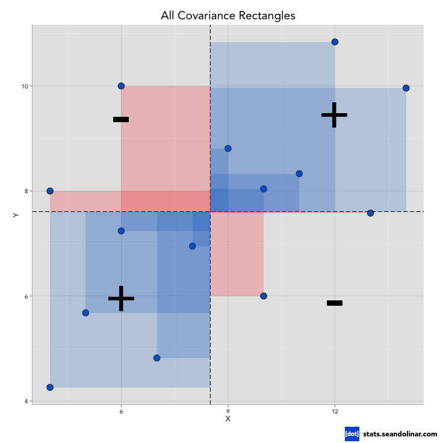
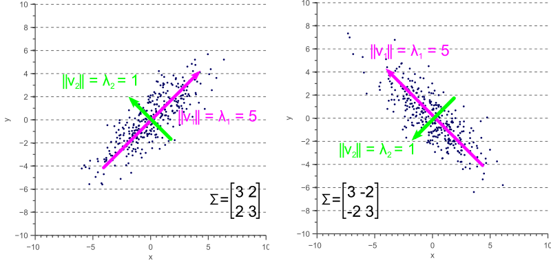
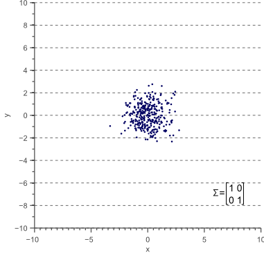
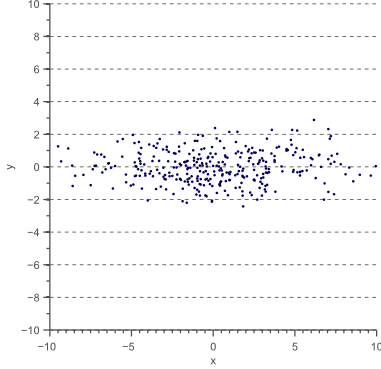
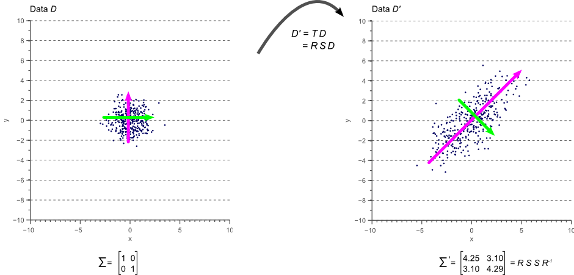

# Covariance And Correlation

> “Covariance” indicates the **direction** of the linear relationship between variables. 
>
> Correlation” on the other hand measures both the **strength and direction** of the linear relationship between two variables.

Correlation is a function of the covariance. **What sets them apart is the fact that correlation values are standardized whereas, covariance values are not.** 

## Visualizing

Lets say we have multiple data points with 2 variables x and y. If we draw a line denoting the mean of x,  $\bar{x}$  and mean of y $\bar{y}$ then we can see that the points are divided into 4 quadrants. 

If we draw a perpendiculat line from these points to the $\bar{x}$ and $\bar{y}$ axes, we will end up multiple squares. 

Note: the lines drawn here, have a sign component i.e. if the line is going down or left then it is considered -ve and if it is going up or right then it is considered +ve. So these squares will have  a +ve area if it lies in the top right and bottom left quadrants and -ve area if it lies on the top left and bottom right quadrant.

The average sum of area of these squares is denoted by $cov(x,y)$.

So, if there are way too many boxes on the top right quadrant we will have a huge +ve area thus a huge covarriance and vice versa.

We can also visualize this that, if there are too many boxes on the top right quadrant that means, the data points represent that for large values of x, we also have large values of y thus meaning high covarriance.

Similarly if for large values of x we have small values of y, then the data points will lie on bottom right quadrant meaning huge -ve covarriance.

But, if the squares somehow cancel each other or the resultant value is very less then we can say that there is no such relationship between x and y. 

If we calculate the average of the sum of the areas with their signs then we get 

$$
\large
\begin{align}
avg & = \frac{1}{n}(Area_{sq_1} + Area_{sq_2} + .... Area_{sq_n}) \\
& = \frac{1}{n}((x_1-\bar{x})(y_1 - \bar{y}) + (x_2 - \bar{x})(y_2 - \bar{y}) + .... (x_n - \bar{x})(y_n - \bar{y})) \\
& = \frac{1}{n}\sum_{i=1}^n(x_i - \bar{x})(y_i - \bar{y}) \\
& = E[(x - \mu_x)(y - \mu_y)]
\end{align}
$$

## Mathematical definition

### Covariance

The covariance of two variables (x and y) can be represented as cov(x,y).
$$
\Large
\begin{align*} 
cov(x,y) & = E[(x - \mu_x)(y - \mu_y)] \\
& = E[xy] - E[x]E[y] \\
& = E[xy] - \mu_{x}\mu_{y}
\end{align*}
$$
For a single variable $x$, $Cov(x,x)$ becomes 
$$
\Large
\begin{align}
cov(x,x) & = E[x^2] - \mu_x^2 \\
& = var(x)
\end{align}
$$
We also know that $standard\ deviation = \sigma(x) = \sqrt{var(x)}$

So for a single variable $x$
$$
\Large
\begin{align}
\sigma(x)^2 & = cov(x,x) \\
& = E[x^2] - (E[x])^2 \\
& = (E[x - E[x]])^2 \\
& = \frac{\sum_{i=1}^{n}(x_i - \bar{x})^2}{n-1}
\end{align}
$$
So for 2 variables $x,y$ :
$$
\large
\begin{equation}
\boxed{cov(x,y) = \frac{\sum_{i=1}^n (x_i - \bar{x})(y_i - \bar{y})}{n-1}}
\end{equation}
$$
Here $(n-1)$ is the [degree of freedom][1] and $n$ is the samples in the dataset.

Here we are using $(n-1)$ in place of $n$ because of the [Bessel’s Correction][2]

### Correlation

The correlation coefficient is also known as the *Pearson product-moment correlation coefficient*, or **Pearson’s correlation coefficient**.

It is obtained by dividing the covariance of the two variables by the product of their standard deviations.

__The values of the correlation coefficient can range from -1 to +1__. The closer it is to +1 or -1, the more closely are the two variables are related. The positive sign signifies the direction of the correlation i.e. if one of the variables increases, the other variable is also supposed to increase.
$$
\Large
\begin{align}
e_{x,y} = corr(x,y) & = \frac{cov(x,y)}{\sigma_x \sigma_y} \\
& = \frac{E[(x-\mu_x)(y-\mu_y)]}{\sigma_x \sigma_y}
\end{align}
$$

## Matrix Representation

Let say we have a data variable $X$ in form of a matrix where each row defines a _data point_ and each column is represents a _variable_ or _feature_.

$$
\begin{align}
X = \begin{bmatrix}
x_{11} & x_{12} & x_{13} & ...... & x_{1p} \\
x_{21} & x{22} & ...... & ....... & x_{2p} \\
..... \\
..... & ..... & x_{ij}  \\
..... \\
x_{n1} & x_{n2} & .... & ..... & x{np}\\
\end{bmatrix}
\end{align}
$$

So sample mean of $j^{th}$ variable is $\large \bar{X_j} = \frac{1}{n} \sum_{i=1}^{n} x_{ij}$

### Covariance Marix

Covariance matrix is given by

$$
S = \begin{bmatrix}
S_1^2 & S_{12} & S_{13} & ... & S_{1p}\\
S_{21} & S_2^2 & S_{23} & ... & S_{2p}\\
S_{31} & S_{32} & S_3^2 & ... & S_{3p}\\
: & : & : & : \\
S_{p1} & S_{p2} & S_{p3} & ... & S_p^2
\end{bmatrix}
$$

where

$S_j^2 = \frac{1}{n}\sum_{i=1}^{n} (s_{ij}- \bar{x_j})^2$ i.e. the variance of $j^{th}$ variable

$S_{jk} = \frac{1}{n}\sum_{i=1}^{n}(x_{ij} - \bar{x_j})(x_{ik} - \bar{x_k})$ i.e. the covariance between $j^{th}$ and $k^{th}$ variable

and $\bar{xj} = \frac{1}{n}\sum_{i=1}^{n}(x_{ij})$ i.e. the mean of $j^{th}$ variable

Here the **covariance matrix is a square matrix** of size $p \times p$  and thus is also equal to its transpose.

We can easily create covariance matrix by using the centered matrix of $X$ i.e. $X_C$ 

$X_C = X - \frac{1}{n}\bar{X}$ i.e. subtracting each column of $X$ by its mean

basically
$$
X_C = \begin{bmatrix}
x_{11} - \bar{x1} & x_{12} - \bar{x_2} & .... & x_{1p} - \bar{x_p} \\
x_{21} - \bar{x1} & x_{22} - \bar{x_2} & .... & x_{2p} - \bar{x_p} \\
: & : & : & : \\
x_{n1} - \bar{x1} & x_{n2} - \bar{x_2} & .... & x_{np} - \bar{x_p} \\
\end{bmatrix}
$$
and 

$$
\Large 
\begin{equation}
\boxed{S = \frac{1}{n}X_C^TX_C}
\end{equation}
$$

### Correlation Matrix

Similarly we can define the correlation matrix of a data matrix $X$ as

$$
R = \begin{bmatrix}
1 & r_{12} & r_{13} & ... & r_{1p}\\
r_{21} & 1 & r_{23} & ... & r_{2p}\\
r_{31} & r_{32} & 1 & ... & r_{3p}\\
: & : & : & : \\
r_{p1} & r_{p2} & r_{p3} & ... & 1
\end{bmatrix}
$$

where 

$\Large r_{jk} = \frac{S_{jk}}{S_jS_k} = \frac{\sum_{i=1}^{n}(s_{ij=\bar{s_j}})(x_{ik - \bar{x_k}})}{\sqrt{\sum_{i=1}^{n}(s_{ij=\bar{s_j}})^2}{\sqrt{\sum_{i=1}^{n}(s_{ik=\bar{s_k}})^2}}}$

Similarly we can create this matrix easily from the data matrix $X$ by using the **scaled or standardized matrix** $X_S$
$$
X_S= \begin{bmatrix}
(x_{11} - \bar{x1})/S_1 & (x_{12} - \bar{x_2})/S_2 & .... & (x_{1p} - \bar{x_p})/S_p \\
(x_{21} - \bar{x1})/S_1 & (x_{22} - \bar{x_2})/S_2 & .... & (x_{2p} - \bar{x_p})/S_p \\
: & : & : & : \\
(x_{p1} - \bar{x1})/S_1 & (x_{p2} - \bar{x_2})/S_2 & .... & (x_{pp} - \bar{x_p})/S_p 
\end{bmatrix}
$$

$$
\Large 
\begin{equation}
\boxed{R = \frac{1}{n}X_S^T X_S}
\end{equation}
$$

# Covariance Vs Correlation

As we see from the formula of covariance, it assumes the units from the product of the units of the two variables. On the other hand, correlation is dimensionless. It is a unit-free measure of the relationship between variables. This is because we divide the value of covariance by the product of standard deviations which have the same units. The value of covariance is affected by the change in scale of the variables. If all the values of the given variable are multiplied by a constant and all the values of another variable are multiplied, by a similar or different constant, then the value of covariance also changes. However, on doing the same, the value of correlation is not influenced by the change in scale of the values. Another difference between covariance and correlation is the range of values that they can assume. While correlation coefficients lie between -1 and +1, covariance can take any value between -∞ and +∞.

## Geometric Inference of Covariance matrix

If we try to set the data for a given covariance of 2 variable we can see that for a given covariance vector, how our dataset can change.

For better visualization we are going to use a gaussian data set and set the covariance matrix to get a few data points.

As we can see here how the covariance matrix for different kind of covariance for a 2 variable dataset affect the data distribution.

As our covariance matrix is a $2 \times 2$ matrix, we can say that it will have 2 eigen values and corresponding to them 2 eigen vectors.

### Visualizing the eigen vectors of covariance matrix

As we can see here, for any covariance matrix it will always have 2 eigen vectors:

-  1^st^, which will be the maximum vector lying in the direction of data spread
- 2^nd^ , which is the least and is in the direction $\perp$ to the 1^st^ eigen vector.

And we can see that the **eigen vectors of the covariance matrix properly identify the direction on which the data is distributed. This property of the covariance matix helps us in finding the projections of the spread of the data points.**

### Covariance matrix as a transformation

Lets say we have a data matrix $D$ then we can apply some transformation to $D$ and transform the data in it. Lets say the trasnformed matrix is $D'$ then trasnformation is given by $D' = TD$ where $T$ is the transformation matrix.

This transformation matrix itself concists of 2 matrix called the rotation matrix $R$(applying of which rotates the axis of the data set) and translation matrix$S$(which scales the data points in the data matrix).

$$T = RS$$

These matrices can be defines as:

$$
R = \begin{bmatrix}
cos(\theta) & -sin(\theta)\\
sin(\theta) & cost(\theta)
\end{bmatrix}
$$

$$
S = \begin{bmatrix}
s_x & 0 \\
0 & s_y
\end{bmatrix}
$$

Here $R$ rotates the axis by $\theta$ degree and $S$ scales the x and y axis by s~x~ and s~y~ units respectively.

Lets say our data set looks like this with $I$ identity matrix as its covariance matrix

 

And we apply a translation of unit 4 along x axis:

Then $D'$ will look like:

Interesting fact is that the covariance matrix of $D'$ is 

$$
\begin{equation}
\begin{bmatrix}
\sigma_x^2 & 0 \\
0 & \sigma_y^2
\end{bmatrix}
= 
\begin{bmatrix}
16 & 0 \\
0 & 1
\end{bmatrix}
\end{equation}
$$

Thus we can say that $T = \sqrt{cov\_matrix}$

As we know that in our case covariance matrix is a square matrix then we can represent it using the eigen values and vectors as:

$cov\ matrix = \Sigma = VLV^{-1}$

This is the [eigen decomposition][3] of the covariance matrix.

We can here say that $V$ represents the rotation matrix as it represents a vector like the rotation matrix, while $\sqrt{L}$ represents the translation matrix as it represents a scalar diagonal matrix similar to a translation matrix.

So the covariance matrix can be further decomposed as:

$$\Sigma = RSSR^{-1} $$ and we know that a transformation matrix $T = RS$ and $T^{T} = (RS)^T = SR^-1$

so $\Sigma = RSSR^-1 = TT^T$ 

So when we use this covariance matrix on our data matrix $D$ we get:

Thus we can conclude here that **covariance matrix is basically a transformation of a gaussian data which is evenly distrbuted if an $I$ identical matrix is it’s covariance matrix.** As soon as we change the covariance matrix or apply the covariance matrix as a transformation we get our final data set.

So when we are given a dataset which doesnt resemble a gaussian data set, we can represent it in terms of a transformation applied, and this transformation can be calculated by finding the covariance matrix.

# References

[1]: degree_of_freedom.md

[2]: population_vs_sample.md

[3]: ../vector_algebra/eigen_vectors.md

------