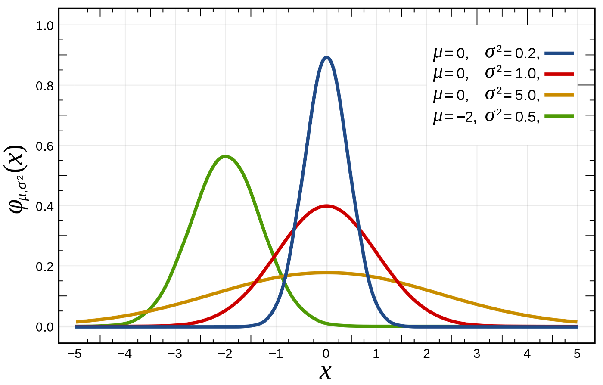

# Gaussian Distribution (a.k.a Normal Distribution)

Gaussian distribution is named after great mathematician and physicist **Carl Friedrich Gauss.** 

## Formula

$$
\LARGE
\begin{aligned}
\boxed{f(x) = \frac{1}{\sigma \sqrt{2\pi}} e^{-\frac{(\mu - x)^2}{2\sigma^2}}}
\end{aligned}
$$

## Central Limit Theorem

Central limit theorem states that 

> when we add large number of independent random variables, irrespective of the original distribution of these variables, their normalized sum tends towards a Gaussian distribution. 

## Properties

- Product of 2 Gaussian is a Gaussian

- Sum of two independent Gaussian random variables is a Gaussian

- Convolution of Gaussian with another Gaussian is a Gaussian

- Fourier transform of Gaussian is a Gaussian

- Its mean, median and mode are all same

- The entire distribution can be specified using just two parameters- mean($\mu$) and variance($\sigma$)

## The gaussian function

$$
\LARGE
\begin{aligned}
\boxed{f(x|a,b,c) = \frac{1}{a \sqrt{2\pi}} e^{-\frac{(x - b)^2}{2c^2}}}
\end{aligned}
$$

is the gaussian function for some real constants $a,b$ and $c$.

Here the parameters are:

- a: Height of the curve’s peak
- b: position of the center of the peak
- c: the width of the bell curve (aka Gaussian RMS width or the standard deviation)

## Gaussian Function over multi-dimensional Vector

We can define the Gaussian function over a D-dimensional vector x as follows:

$$
\Large
\begin{aligned}
\boxed{\mathcal{N}(x|\mu,\Sigma) = \frac{1}{(2\pi)^{D/2}\sqrt{|\Sigma|}}e^{-\frac{(x-\mu)^T(x-\mu)}{\Sigma}}}
\end{aligned}
$$

Here the parameters are:

- $x$: the D-dimensional vector
- $\mu$: is the D-dimensional mean vector
- $\Sigma$: is the D$\times$D dimensional covariance matrix
