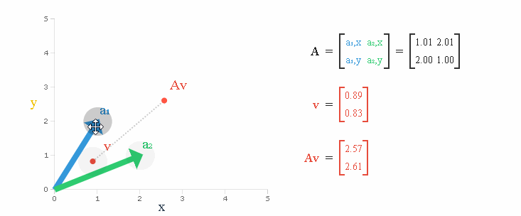

# Eigen Values and Eigen Vectors

## Intuition

Before we begin with calculating eigen values and vectors, lets first understand what it represent.

Let say we have a matrix $A$ of shape $n*n$.

We can treat this matrix as a transformation matrix to transform some other matrix/vector $X$ into a matrix $Y$.

This transformation can be denoted as $\large AX = Y$ 

The matrix acting on a vector $X$ does two things to the vector xx.

1. It scales the vector.
2. It rotates the vector.

However, for any matrix $A$, there are some *favored vectors/directions*. When the matrix acts on these favored vectors, the action essentially results in just scaling the vector. There is no rotation. These favored vectors are precisely the eigenvectors and the amount by which each of these favored vectors stretches or compresses is the eigenvalue.

> The eigenvectors are the “axes” of the transformation represented by the matrix.

> The eigenvalue is the amount the eigenvector is scaled up or down when going through the matrix.

A matrix $A$ acts on vectors $v$ like a function does, with input $v$ and output $Av$. Eigenvectors are vectors for which $Av$ is parallel to $v$.

i.e $Av = \lambda v$, here $v$ is the eigenvector and $\lambda $ is the eigenvalue. 

## Importance

Consider the eigenvector corresponding to the maximum (absolute) eigenvalue. If we take a vector along this eigenvector, then the action of the matrix is maximum. **No other vector when acted by this matrix will get stretched as much as this eigenvector**.

Hence, if a vector were to lie "close" to this eigen direction, then the "effect" of action by this matrix will be "large" i.e. the action by this matrix results in "large" response for this vector. The effect of the action by this matrix is high for large (absolute) eigenvalues and less for small (absolute) eigenvalues. Hence, the directions/vectors along which this action is high are called the principal directions or principal eigenvectors. The corresponding eigenvalues are called the principal values.

If a matrix is of shape $n \times n$ then it will have **$$n$$**  **eigen values** $\lambda_1, \lambda_2, ..... \lambda_n$ and corresponding to these values we will have $n$ unique eigen vectors which are **linearly independent** 

## Eigen Decomposition

Eigen decomposition a.k.a **Spectral decomposition** is the factorization of a matrix into a canonical form, whereby the matrix is represneted in terms of its eigen values and eigen vectors.

Only diagonalizable matrices can be factorized in this way.

If $A$ is a square matrix of shape $n \times n$ with $n$ linearly indpendent eigen vectors $q_i$, then $A$ can be vactorized as

$$
\begin{gathered}
 & A\times Q & = QD & \text{;[A matrix multiplied with its eigen vector only scales with a factor of the eigen value]} \\
 then, & A & = QDQ^{-1}
\end{gathered}
$$

where $Q$ is a sqare matrix of shape $n \times n$ whose $i^{th}$ column is the eigen vector $q_i$

$D$ is the diagonal matrix whise diagonal elements are the coresponding eigen values i.e $d_{ii} = \lambda_i$

**Note: Only [diagonalizable matrix][1] can be factorized this way**

# Reference

[1]:diagonal_matrix.md

------

