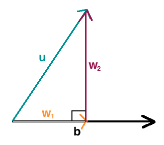

# Orthogonal Projections And Vector Component

Main backbone of PCA.

Let us consider a vector $\vec{u}$ .

We can write $\vec{u}$ as sum of 2 mutully perpendicular vectors as 

$$\begin{align}\Large \tag{1} \vec{u} = \vec{w_1} + \vec{w_2}\end{align}$$,

 where $\vec{w_1} \perp \vec{w_2}$.

Let say we have another vector $\vec{b}$, where $\vec{b}$ and $\vec{u}$ have same initial point

So we can have a vector $\vec{w_1}$ from the same initial point such that $\vec{w_1}$ is parallel to $\vec{b}$.

From $(1)$ we can say that we can now draw another vector $\vec{w_2}$, such that

- it starts from the point where $\vec{w_1}$ ends 
- it is $\perp$ to both $\vec{w_1}$ and $\vec{b}$, (as  $\vec{w_1}$ and $\vec{b}$ are parallel)

So this vector $\vec{w_1}$, has a special name called Orthogonal Projection of $\vec{u}$, along $\vec{b}$.

And the vector $\vec{w_2}$ is termed as the vector component of $\vec{u}$ Orthogonal to $\vec{b}$

So formally defined:

If $\large \vec{u} = \vec{w_1} + \vec{w_2}$ and $\vec{w_1}$ is parallel to $\vec{b}$ and is $\perp$ to $\vec{w_2}$ then, $\vec{w_1}$ can be defines as the __Orthogonal Projection of $\vec{u}$ along $\vec{b}$__ and is denoted by $\begin{align}\large \vec{w_1} = proj_b \cdot \vec{u} = \frac{\vec{u} \cdot \vec{b}}{||\vec{b}||^2}\vec{b}\end{align}$ 

and  $\vec{w_2}$ is defined as the __Vector Component of $\vec{u}$ Orthogonal to $\vec{b}$ __and is denoted by 

$$\large \vec{w_2} = \vec{u} - proj_b \cdot \vec{u}$$

