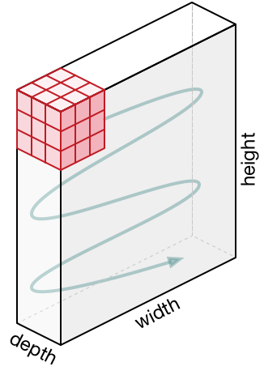
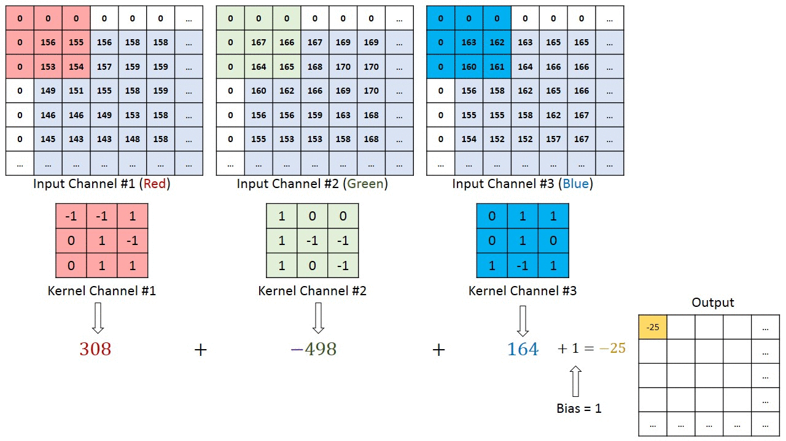
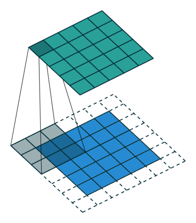
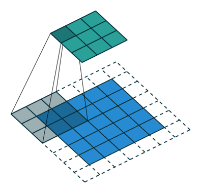
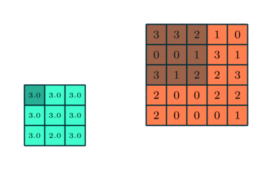

# Convolution Neural Netowrk

## The Layers

CNN has 2 different kind of layers:

1. Feature Extraction Layer 
   1. The Convolution Layer
   2. Non-Linear Layer
   3. Pooling Layer
2. Fully Connected Dense Layer

The convolution layer itself contains 3 different kinds of layers i.e. the convolution layer itself followed by the non-linear layer followed by the pooling layer.

## Feature Extraction Layers

### Convolution Layer

Convolution is the first layer to extract features from an input image. Convolution preserves the relationship between pixels by learning image features.

It has the filter as the weights which when applied on the image outputs another set of matrix. This filter matrix is also known as the kernel.

It takes 2 parameters:

* Stride: Stride is the number of pixels shifts over the input matrix.
* Padding: It is the number of pixels we need to add\(usually of value =  0\) to input matrix so that filters can be applied on it easily

Stride=1 animation

Stride=2 animation

Padding can be of 3 types:

* $\(p\_h, p\_w\)$ pixels in size, or
* valid padding: i.e. $p\_h = p\_w = 0$
* same padding: where $\large p\_h = \frac{f\_h - 1}{w}$ and $\large p\_w = \frac{f\_w - 1}{2}$

The output matrix is also known as the feature map.

**Input**: A Matrix $I$ of dimension $\(h,w,d\)$

**Parameters**:

1. Filter or kernel matrix dimension $\(batch\_size, f\_h, f\_w, d\)$
2. **\[HyperParameter\]** padding matrix of size $\(p\_h,p\_w\)$
3. **\[HyperParameter\]** stride of value $s$

**Weights**: Filter Matrix $f$ of dimension $\(f_h, fw, d, fd\)$ \_\[Note: depth of filter and input matrix is same\]_

**Operation**: Applying of filters on the input matrix.

$$\begin{align}\tag{1}O = I*f\end{align}$$

**Output** : A Matrix $O$ of dimension $\large \(batch\_size, \frac{h+2_p\_h - f\_h}{s}+1, \frac{w+2_p\_w-f\_w}{s}+1, f\_d \)$

### Non-Linear Layer

The main purpose of the non-linear layer is to introduce non-linearity in our model. Because most real world problems don’t pose a linearly separable distribution, so to tackle this non-linearity in real world problems, we introduce this layer.

We implement this layer with the help of activation functions, which is the same as that of vanilla neural network. Common activation function is the ReLU\(Rectified Linear Unit\) function.

**Input**: Usually the output matrix $O$ of a Convolution layer of dimension $\(batch\_size, w,h,d\)$

**Parameters**: activation function $f\(x\)$

**Weights**: None

**Operation** : Applying of activation function on each pixel.

$\begin{align}\tag{2}A = f\(x\); for\space x \in O\end{align}$

**Output**: A Matrix $A$ of same dimension as input $\(batch\_size,w,h,d\)$

### Pooling Layer

Pooling layers section is used to reduce the size of the image when the images are too large. The process of applying a pooling layer is also called sub-sampling or down-sampling.

It has 3 parameters:

* Filter Size: The dimension of the filter to be applied on the input matrix
* Stride: The jump that has to be made by the filter while applying it on the input matrix.
* type: The function that has to be applied by the filter to get the output matrix.
  * Max
  * Sum
  * Avg

We can say that convolution layer is a special type of pooling layer which has 1 extra attribute i.e. padding and the function applied is multiplication.

**Note: The depth of the input matrix doesn’t change while pooling, only the height and width changes, depth being the same of the output matrix**

**Input**: A matrix of dimension $\(batch\_size, h,w,d\)$

**Parameters**:

1. Filter matrix dimension $\(f\_h, f\_w\)$
2. **\[HyperParameter\]** Stride size $s$
3. **\[HyperParameter\]** Pooling Type $f\(x\)$

**Weights**: Filter matrix $\(f\_h, f\_w\)$

**Output**: A matrix of dimension $\large\(batch\_size, \frac{h-f\_h}{s}+1, \frac{w-f\_w}{s}+1\)$

## Fully Connected Layer

It is similar to the vanilla neural network, having input layer, multiple hidden layers and an output layer. This layer is also called the classification layer.

This layer takes input the extracted features from the feature extraction layer and performs classification on it.

It contains 3 types of layer:

1. Flatten Layer
2. Hidden Layers
3. Ouput Layer

### Flatten Layer

This layer takes the input of feature extraction layer and flattens the n-dimensional ouput of the feature extraction layer. This flattened input is then passed onto the hidden layers for extraction. This layer acts as the input layer to the Dense neural network ahead.

**Input**: Matrix of n-diemension ouput of feature extraction layer of dimension $\(batch\_size, h,w,d\)$

**Parameters**: None

**Weights**: None

**Operation**: Converting the n-dimensional input to 1-dimensional vector

**Ouput**: Flattened matrix of dimension $\(batch\_size, h_w_d\)$

## Hidden Layer

These are the same hidden layers that are present in a vanilla neural network. Each contains a no of nodes and are fully connected with each other. Each layer also applies an activation function to the $input\*weight+bias$ ouput of each neuron.

**Input**: Input from the input layer

**Parameters**:

1. No of hidden layers $\large n = n\_{hidden\_layers}$
2. No of nodes in each hidden layer $W\(n\_i,m\_i\)$ , where $m\_i$ is the no of nodes in $i^{th}$ layer
3. Activation function of each layer $f\(n,f\_i\(x\)\)$, where $f\_i\(x\)$ is the activation in $i^{th}$ layer

**Operation** : Same as that of hidden layers in vanilla neural network

**Ouput**: Depending on the no of neurons on the last hidden layer, a matrix of dimension $\(batch\_size, m\_l\)$ where $m\_l$ is the no of nodes in the last hidden layer

### Ouput Layer

Depending on whether it is a classification problem or regression problem we have oupt nodes based on that.

**Input**: Depending on the no of nodes in the last hidden layer a matrix of dimension $\(batch\_size, m\_l\)$ where $m\_l$ is the no of nodes in the last hidden layer

**Parameters**:

1. No of ouput nodes $n\_{output}$
2. Activation function of the ouput layer $f\(x\)$

**Operation**: Same as the ouput layer of a vanilla neural network

**Ouput**: If it is a classification problem then the nodes will denote the probability of each class. If its a regression problem then the ouput value of the problem.

