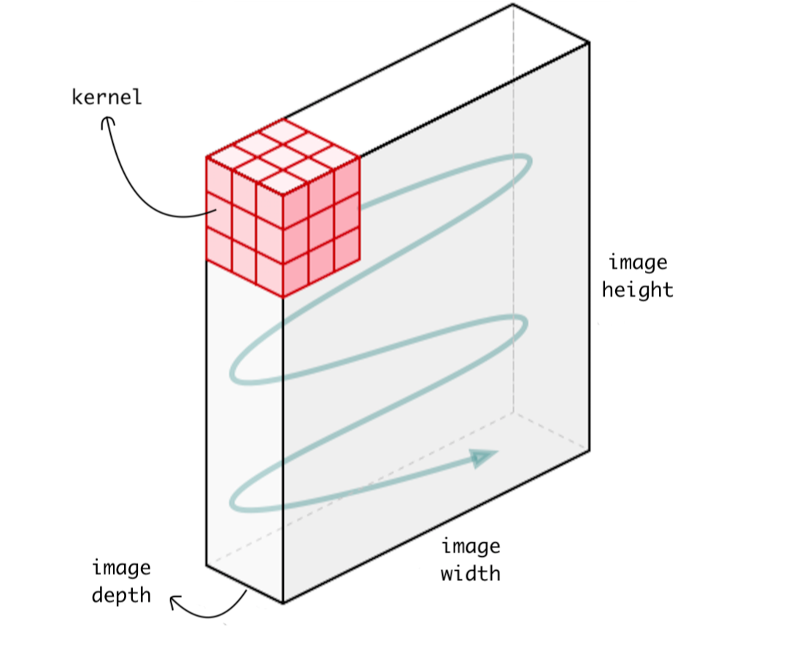

# Dimensions in Convolution Operation

Depending on the dimension of the kernel and the dimension of the data on which the kernel is applied, we have 1D, 2D and 3D convolution layer or operation.

**Note: When mentioning the kernel dimension we never mention the depth, as the depth varies based on the layer and the input to the layer.**

## 2D Convolution

This is the standard **Convolution Neural Network** which was first introduced in **Lenet-5** architecture. **Conv2D** is generally used on Image data. It is called 2 dimensional CNN because the **kernel** slides along 2 dimensions on the data as shown in the following image.

Here we only mention the width and height of the kernel but not the depth. 

**Note: It is called 2D convolution because the kernel spans across both width and height and not because we mention 2 parameters.**

## 1D Convolution

 In Conv1D, **kernel** slides along one dimension. In this scenario we focus on time-series data, i.e. data which has only 1 dimension i.e. time. We might have other input data where the dimension is not time but in most of the cases we have time as the single dimension.

eg: Data from acceleratometer. Data represent the acceleration in all the 3 axes. 1D CNN can perform activity recognition task from accelerometer data, such as if the person is standing, walking, jumping etc.

Following plot illustrate how the kernel will move on accelerometer data. Each row represents time series acceleration for some axis. The kernel can only move in one dimension along the axis of time.

Similarly, 1D CNNs are also used on audio and text data since we can also represent the sound and texts as a time series data.

## 3D convolution

Conv3D is mostly used with 3D image data. Such as **Magnetic Resonance Imaging** (MRI) data. MRI data is widely used for examining the brain, spinal cords, internal organs and many more. A **Computerized Tomography** (CT) Scan is also an example of 3D data, which is created by combining a series of X-rays image taken from different angles around the body. We can use Conv3D to classify this medical data or extract features from it.

## Summary

- In **1D CNN**, kernel moves in **1** direction. Input and output data of 1D CNN is **2** dimensional. Mostly used on **Time-Series** data.

- In **2D CNN**, kernel moves in **2** directions. Input and output data of 2D CNN is **3** dimensional. Mostly used on **Image** data.

- In **3D CNN**, kernel moves in **3** directions. Input and output data of 3D CNN is **4** dimensional. Mostly used on **3D** **Image** data (MRI, CT Scans).