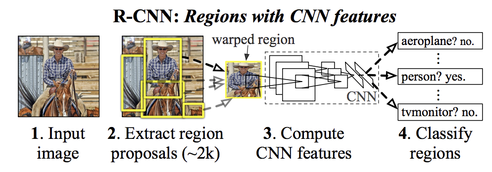
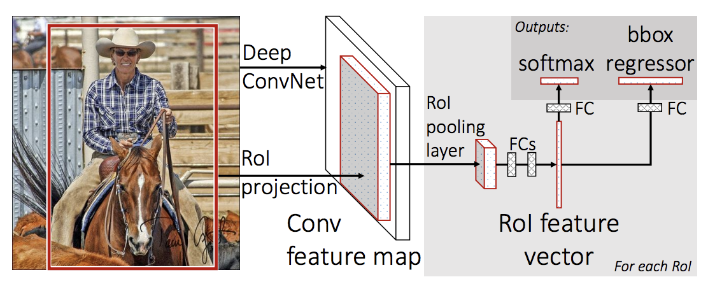
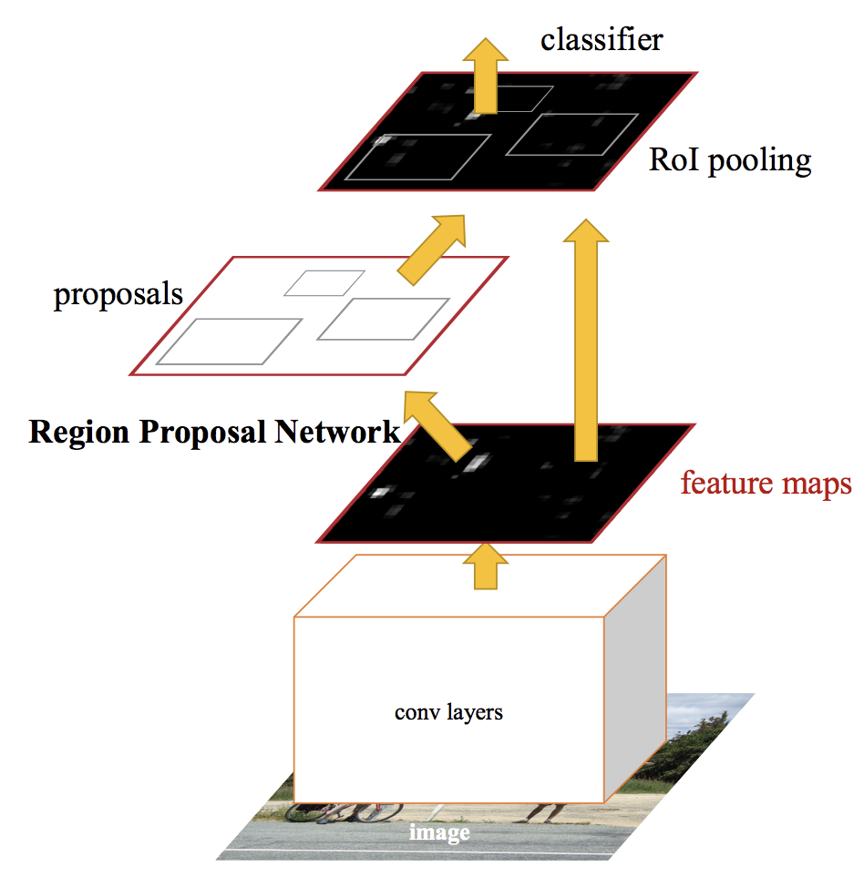
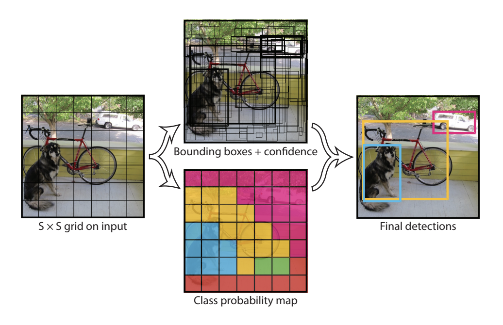

# Object Detection

It is basically a 2 task process

* _Image Classification_: classifying input image by predicting a label for it
* _Object Localization_: Identifying the location of 1 or more obects in an image by providing bounding box ariund the image.

## Algorithms

There is a class of CNN called the R-CNN which stands for _Region with CNN features_ or _Region Based CNN_ developed by Ross Girshick et al.

This class includes

* R-CNN \(**2014**\)
* Fast R-CNN \(**2015**\) and 
* Faster-RCNN \(**2016**\)

## R-CNN

This algorithm has 3 modules:

1. Region Proposal
2. Feature Extraction
3. Classifier

## Fast R-CNN

1. A pre-trained CNN like VGG-16 is used for feature extraction
2. This is then given as input to a layer called _Region of Interest Pooling_ layer or the _RoI Pooling_ layer. 
3. The output of the CNN is then interpreted by a fully connected layer and then it is treated by 2 parallel layers
   1. For class prediction
   2. Bounding box prediction
   3. This process is then repeated for each region of interest in a given image

## Faster R-CNN

Improved Fast R-CNN by **Shaoqing Ren** et al

1. **Region Proposal Network** - uses CNN for proposing regions and the type of object to concider in the region.
2. **Fast R-CNN** - for extracting features from the proposed regions and ouputing the bounding box and class

## YOLO

_You only Look once_

It is much faster than R-CNN and can be used for object recognition in real time.

Developed by **Joseph Redmon** et al in **2015**.

Architecture:

* Splits the image into grid cells
* Each cell predicts a bounding box\(x,y, height , width\) and a confidence

## YOLOv2

by **Joseph Redmon** and **Ali Farhadi** in **2016**

Like Faster R-CNN this also uses pre-defined bounding boxes, found using k-means analysis.

## YOLOv3

Further improved by **Joseph Redmon** and **Ali Farhadi** in **2018**

