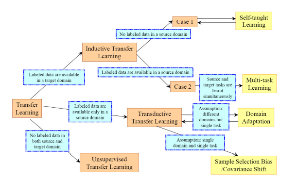
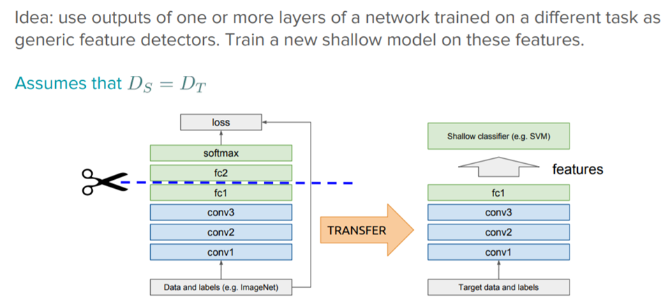
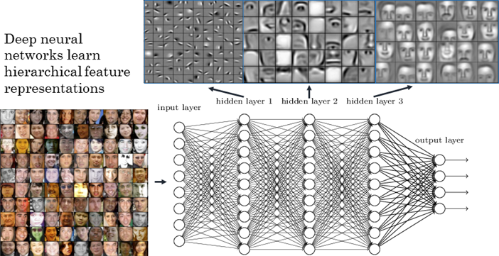
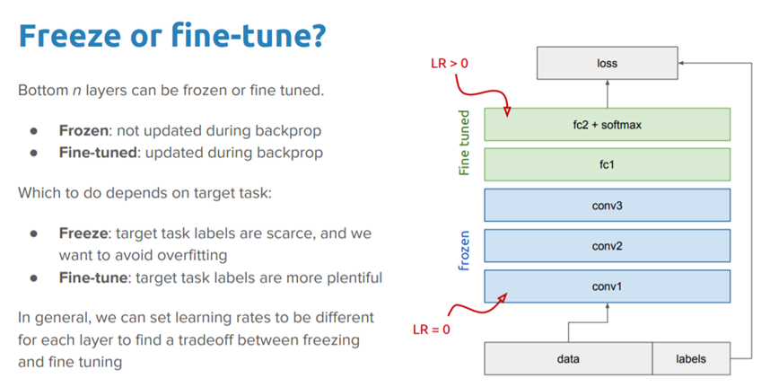
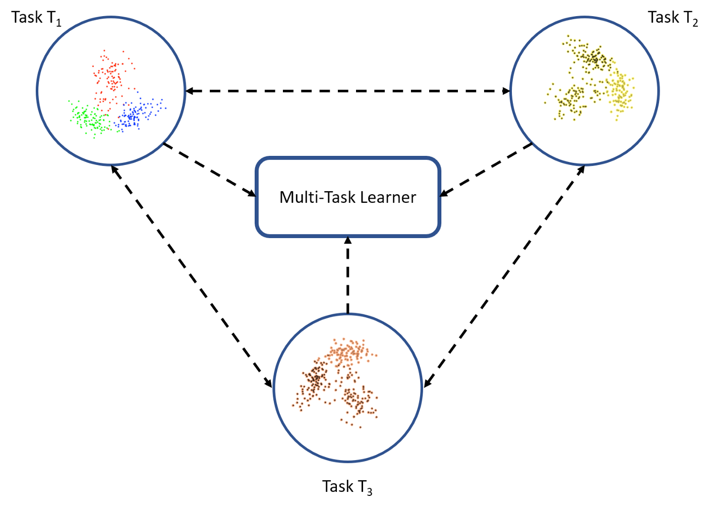

# Transfer Learning

## Introduction

Transfer learning is a machine learning technique where a model trained on one task is re-purposed on a second related task.

Transfer learning only works in deep learning if the model features learned from the first task are general.

Terms such as *Learning to Learn*, *Knowledge Consolidation*, and *Inductive Transfer* are used interchangeably with transfer learning.

The main motivation for Transfer Learning is to see how we can leverage knowledge from a pre-trained models and use it to solve new problems.

## Formal Definition

 In their paper, [*A Survey on Transfer Learning*](https://www.cse.ust.hk/~qyang/Docs/2009/tkde_transfer_learning.pdf), Pan and Yang use domain, task, and probabilities to present a framework for understanding transfer learning. The framework is defined as follows:

A domain, ***D***, is defined as a two-element tuple consisting of feature space, ***ꭕ***, and probability, ***P(Χ)***, where ***Χ*** is a sample data point and  ***X = {x~1~, x~2~, ….. x~n~}*** . Thus, we can represent the domain mathematically as ***D = {ꭕ,P(Χ)}***

Here ***xᵢ*** represents a specific vector as represented in the above depiction.

 A task, ***T***, on the other hand, can be defined as a two-element tuple of the label space, ***γ***, and objective function, ***η***. The objective function can also be denoted as ***P(γ| Χ)*** from a probabilistic view point.

So ***T = {γ, P(Y|X) = {γ, η)*** and ***Y = {y~1~, y~2~, …. y~n~}***

> Given a source domain ***D~s~*** , a corresponding source task ***T~s~***, as well as a target domain ***D~T~*** an a target task ***T~T~***, the objectve of transfer learning now is to enable us to learn the target conditional probability distribution ***P(T~T~ | X~T~)*** in ***D~T~***  with the information gained from ***D~S~*** and ***T~S~*** where ***D~S***~ $\not=$ ***D~T~*** and ***T~S~*** $\not =$ ***T~T~***.
>
> In most cases a limited number of labeled target examples, which is exponentially smller than the numbe of labeled source examples are assumed to be available.

## Scenarios

There are 4 scenarios which can take place:

- ***X~S~ $\not =$ X~T~*** i.e. feature space of the source and target domain are different.
  - eg: Documents written in 2 languages where source and target language are different and we have to process the document.
- ***P(X~S~ )$\not =$ P(X~T~)*** i.e.  probability distribution of source and target domain are different
  - eg: Document written in different topics that need to be processed,source and target topics are diffferent
- ***Y~S~ $\not =$ Y~T~*** i.e. Label spaces between the 2 tasks are different.
  - eg: document need to be assigned in different tasks. This is rare that labels are different by conditional spaces are same.
- ***P(Y~S~|X~S~) $\not =$ P(Y~T~|X~T~)*** i.e. conditional probability distributions of the source and target tasks are different.
  - eg: Source and target document with regard to their classes.

## Key Question to Answer

- **What to transfer:** This is the first and the most important step in the whole process. We try to seek answers about which part of the knowledge can be transferred from the source to the target in order to improve the performance of the target task. When trying to answer this question, we try to identify which portion of knowledge is source-specific and what is common between the source and the target.
- **When to transfer:** There can be scenarios where transferring knowledge for the sake of it may make matters worse than improving anything (also known as negative transfer). We should aim at utilizing transfer learning to improve target task performance/results and not degrade them. We need to be careful about when to transfer and when not to.
- **How to transfer:** Once the *what* and *when* have been answered, we can proceed towards identifying ways of actually transferring the knowledge across domains/tasks. This involves changes to existing algorithms and different techniques, which we will cover in later sections of this article. Also, specific case studies are lined up in the end for a better understanding of how to transfer.

## Strategies

### Inductive Transfer Learning

In this scenario, the source and target domains are the same, yet the source and target tasks are different from each other. The algorithms try to utilize the inductive biases of the source domain to help improve the target task. Depending upon whether the source domain contains labeled data or not, this can be further divided into two subcategories, similar to multitask learning and self-taught learning, respectively.

- The goal of Inductive transfer learning is to improve the performance of the target predictive function
- Inductive transfer learning requires a few labeled data in the target domain as the training data to induce the target predictive function
- If the source and target domains both have labelled data then we can perform multi-tasking transfer learning
- If the source has labelled data and target task does not have labelled data then we can perform self-learning transfer learning

### Unsupervised Transfer Learning

 This setting is similar to inductive transfer itself, with a focus on unsupervised tasks in the target domain. The source and target domains are similar, but the tasks are different. In this scenario, labeled data is unavailable in either of the domains.

### Transductive Transfer Learning

 In this scenario, there are similarities between the source and target tasks, but the corresponding domains are different. In this setting, the source domain has a lot of labeled data, while the **target domain has none**. This can be further classified into subcategories, referring to settings where either the feature spaces are different or the marginal probabilities.

Transductive Transfer learning can be applied when

- Feature spaces between the source and target domains can be different or
- Feature spaces between domains are the same but the marginal probability distributions of the input data are different. This is also referred to as Domain adaptation.

<table>
  <thead>
    <tr>
      <th>Learning Strategy</th>
      <th>Realated Areas</th>
	    <th>Source And Target Domains</th>
  	  <th>Source Domain Labels</th>
    	<th>Target Domain Labels</th>
    	<th>Source And Target Tasks</th>
    	<th>Tasks</th>
    </tr>
  </thead>
  <tbody>
    <tr>
      <td>Inductive Trasnfer Learning</td>
      <td>Muti-Task Learning</td>
      <td>Same</td>
      <td>Available</td>
      <td>Available</td>
      <td>Different but Related</td>
      <td>
        <ul>
        	<li>Regression</li>
          <li>Classification</li>
        </ul>
       </td>
    </tr>
    <tr>
      <td>-</td>
      <td>Slef-Taught Learning</td>
      <td>Same</td>
      <td>Unavailable</td>
      <td>Available</td>
      <td>Different but Related</td>
      <td>
        <ul>
          <li>Regression</li>
          <li>Classification</li>
        </ul>
      </td>
    </tr>
    <tr>
      <td>Unsupervised Transfer Learning</td>
      <td>-</td>
      <td>Different but Related</td>
      <td>Unavailable</td>
      <td>Unvailable</td>
      <td>Different but Related</td>
      <td>
        <ul>
          <li>Clustering</li>
          <li>Dimensionality Reduction</li>
        </ul>
      </td>
    </tr>
    <tr>
      <td>Transductive Transfer Learning</td>
      <td>
        <ul>
          <li>Domain Adaption</li>
          <li>Sample Selection Bias and Covariate Shift</li>
        </ul>
      </td>
      <td>Different but Related</td>
      <td>Available</td>
      <td>Unavailable</td>
      <td>Same</td>
      <td>
        <ul>
          <li>Regression</li>
          <li>Classification</li>
        </ul>
      </td>
    </tr>
  </tbody>
</table>

## What to Transfer

### Instance Transfer

Reusing knowledge from the source domain to the target task is usually an ideal scenario. In most cases, the source domain data cannot be reused directly. Rather, there are **certain instances from the source domain that can be reused along with target data to improve results**. In case of inductive transfer, modifications such as AdaBoost by Dai and their co-authors help utilize training instances from the source domain for improvements in the target task.

### Feature Representation Transfer

This approach aims to minimize domain divergence and reduce error rates by identifying good feature representations that can be utilized from the source to target domains. Depending upon the availability of labeled data, supervised or unsupervised methods may be applied for feature-representation-based transfers.

### Parameter Transfer

This approach works on the assumption that the models for related tasks share some parameters or prior distribution of hyperparameters. Unlike multitask learning, where both the source and target tasks are learned simultaneously, for transfer learning, we may apply additional weightage to the loss of the target domain to improve overall performance.

### Relational Knowledge Transfer

Unlike the preceding three approaches, the relational-knowledge transfer attempts to handle non-IID data, such as data that is not independent and identically distributed. In other words, data, where each data point has a relationship with other data points; for instance, social network data utilizes relational-knowledge-transfer techniques.

<table>
  <thead>
    <tr>
      <th>Transfer Method</th>
      <th>Inductive Transfer Learning</th>
      <th>Transductive Transfer Learning</th>
      <th>Unsupervised Trasnfer Learning</th>
    </tr>
  </thead>
  <tbody>
    <tr>
      <td>Instance Transfer</td>
      <td>☑️</td>
      <td>☑️</td>
      <td>-</td>
    </tr>
    <tr>
      <td>Feature Representation Transfer</td>
      <td>☑️</td>
      <td>☑️</td>
      <td>☑️</td>
    </tr>
    <tr>
      <td>Parameter Transfer</td>
      <td>☑️</td>
      <td>-</td>
      <td>-</td>
    </tr>
    <tr>
      <td>Relational Knowledge Transfer</td>
      <td>☑️</td>
      <td>-</td>
      <td>-</td>
    </tr>
  </tbody>
</table>

## Transfer Learning In DEEP LEARNING

Deep learning models are representative of what is also known as ***inductive learning***.. The objective for inductive-learning algorithms is to infer a mapping from a set of training examples. For instance, in cases of classification, the model learns mapping between input features and class labels. In order for such a learner to generalize well on unseen data, its algorithm works with a set of assumptions related to the distribution of the training data. These sets of assumptions are known as ***inductive bias***.

***Inductive transfer techniques*** utilize the inductive biases of the source task to assist the target task. This can be done in different ways, such as by adjusting the inductive bias of the target task by limiting the model space, narrowing down the hypothesis space, or making adjustments to the search process itself with the help of knowledge from the source task.

### Using Pre-trained models as feature extractors

Deep learning systems and models are layered architectures that learn different features at different layers (hierarchical representations of layered features). These layers are then finally connected to a last layer (usually a fully connected layer, in the case of supervised learning) to get the final output. This layered architecture allows us to utilize a pre-trained network (such as Inception V3 or VGG) without its final layer as a fixed feature extractor for other tasks.

> *The key idea here is to just leverage the pre-trained model’s weighted layers to extract features but not to update the weights of the model’s layers during training with new data for the new task.*

Eg: if we utilize AlexNet without its final classification layer, it will help us transform images from a new domain task into a 4096-dimensional vector based on its hidden states, thus enabling us to extract features from a new domain task, utilizing the knowledge from a source-domain task. This is one of the most widely utilized methods of performing transfer learning using deep neural networks.

### Fine tuning pre-trained models

This is a more involved technique, where we do not just replace the final layer (for classification/regression), but we also selectively retrain some of the previous layers. Deep neural networks are highly configurable architectures with various hyperparameters.

We know that the initial layers have been sen to capture generic features while the later ones are more focused on specific task.

For eg: Face recognition model here learns basic features(like edges, eyes nose, ears) in the initial layers and more advanced features(like face structure, realtional positioning of facial items, jaw structe etc) in the later layers.

Using this insight, we may freeze (fix weights) certain layers while retraining, or fine-tune the rest of them to suit our needs. In this case, we utilize the knowledge in terms of the overall architecture of the network and use its states as the starting point for our retraining step. This, in turn, helps us achieve better performance with less training time.

### Freezeing Vs Fine-Tuning

Whether to just freeze the layers and train the fully connected layers or should we also fine-tune the later layers which focus on advanced features?

#### Pre-trained model for Computer Vision

- VGG-16
- VGG-19
- Inceptionv3
- XCeption
- ResNet-50

#### Pre-trained model for NLP

- Word2Vec
- GloVe
- FastText
- Universal Sentence Encoder 
- Bidirectional Encoder Representation From Transformers(BERT)

### Deep Transfer Learning

#### Domain Adaptation

Domain adaption is usually referred to in scenarios where the marginal probabilities between the source and target domains are different, such as ***P(Xₛ) ≠ P(Xₜ)***. 

For instance, a corpus of movie reviews labeled as positive or negative would be different from a corpus of product-review sentiments. A classifier trained on movie-review sentiment would see a different distribution if utilized to classify product reviews. Thus, domain adaptation techniques are utilized in transfer learning in these scenarios.

#### Domain Confusion

It is worth re-iterating that different layers in a deep learning network capture different sets of features. We can utilize this fact to learn domain-invariant features and improve their transferability across domains. Instead of allowing the model to learn any representation, we nudge the representations of both domains to be as similar as possible. This can be achieved by applying certain pre-processing steps directly to the representations themselves.

The basic idea behind this technique is to add another objective to the source model to encourage similarity by confusing the domain itself, hence domain confusion.

#### Multi Task Learning

In the case of multitask learning, several tasks are learned simultaneously without distinction between the source and targets. In this case, the learner receives information about multiple tasks at once, as compared to transfer learning, where the learner initially has no idea about the target task. This is depicted in the following figure.

#### One-Short Learning

Deep learning systems are data-hungry by nature, such that they need many training examples to learn the weights. This is one of the limiting aspects of deep neural networks, though such is not the case with human learning. 

One-shot learning is a variant of transfer learning, where we try to infer the required output based on just one or a few training examples. This is essentially helpful in real-world scenarios where it is not possible to have labeled data for every possible class (if it is a classification task), and in scenarios where new classes can be added often. 

The landmark paper by Fei-Fei and their co-authors, [*‘One Shot Learning of Object Categories’*](https://ieeexplore.ieee.org/document/1597116/), is supposedly what coined the term one-shot learning and the research in this sub-field. This paper presented a variation on a Bayesian framework for representation learning for object categorization. This approach has since been improved upon, and applied using deep learning systems.

#### Zero-shot Learning

Zero-shot learning is another extreme variant of transfer learning, which relies on no labeled examples to learn a task. 

Zero-data learning or zero-short learning methods, make clever adjustments during the training stage itself to exploit additional information to understand unseen data. 

In their book on *Deep Learning*, Goodfellow and their co-authors present zero-shot learning as a scenario where three variables are learned, such as the traditional input variable, ***x***, the traditional output variable, ***y***, and the additional random variable that describes the task, ***T***. The model is thus trained to learn the conditional probability distribution of ***P(y | x, T)***. Zero-shot learning comes in handy in scenarios such as machine translation, where we may not even have labels in the target language.

## Advantages

- Helps solve complex real-world problems with several constraints
- Tackle problems like having little or almost no labeled data availability
- Ease of transfering knowledge from one model to another based on domains and tasks
- Provides a path towards achieving Artificial General Intelligence some day in the future!

## Challenges

### Negative Transfer

The cases we have discussed so far talk about improvements in target tasks based on knowledge transfer from the source task. There are cases when transfer learning can lead to a drop in performance. Negative transfer refers to scenarios where the transfer of knowledge from the source to the target does not lead to any improvement, but rather causes a drop in the overall performance of the target task.

There can be various reasons for negative transfer, such as cases when the source task is not sufficiently related to the target task, or if the transfer method could not leverage the relationship between the source and target tasks very well. 

Bayesian approaches by Bakker and their co-authors, along with other techniques exploring clustering-based solutions to identify relatedness, are being researched to avoid negative transfers.

### Transfer Bounds

To gauge the amount for the transfer, Hassan Mahmud and their co-authors used Kolmogorov complexity to prove certain theoretical bounds to analyze transfer learning and measure relatedness between tasks. Eaton and their co-authors presented a novel graph-based approach to measure knowledge transfer.

-----

# Reference

1. [Medium:TowardsDataScience][https://towardsdatascience.com/a-comprehensive-hands-on-guide-to-transfer-learning-with-real-world-applications-in-deep-learning-212bf3b2f27a]