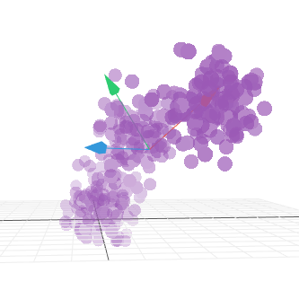
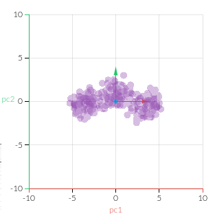

# PCA

## PCA \(Principal Component Analysis\)

The best features that we can have for creating a model and work best with a target variable ares:

* **High Variance**
* **Uncorrelated:** features that are highly correlated with each other are less useful and in certain cases downright harmful. 
* **High Correlation with Target**

PCA \(Principal Components Analysis\) gives us our ideal set of features. **It creates a set of principal components that are rank ordered by variance** \(the first component has higher variance than the second, the second has higher variance than the third, and so on\)**, uncorrelated, and low in number** \(we can throw away the lower ranked components as they contain little signal\).

Definition of Othogonal projection is given [here](../../mathematics/vector_algebra/orthogonal_projections.md).

### Method

* Calculate the covariance matrix of the data points.
* Caclculate the eigen vectors and the corresponding eigen values.
* Sort the eigen vectors according to their corresponding eigen values in decreasing order.
* Choose the first k eigen vectors and that will be the new k dimensions.
* Transform the original n dimensional data points into k dimensions.

### Explanation

As we know that the \[eigen vectors of the covariance matrix identifies the distribution of the data\]\[2\] we can thus use it our advantage as our new axis and transform\(basically rotate\) our data into this new axis.

But the crux of PCA lies in selecting only the largest ‘k’ eigen values and its corresponding eigen vectors. This enables us to convert our data into a k-demensional plane without loosing much of the data’s distrbution’s property. And as we know that the eigen vectors are linearly independent, so our new asix or features are also linearly independent.

Note: We are still loosing some data that is expressed in the directions of the rest of the $n-k$ dimensions but for vizualisation purpose we are trading off that information with the ease of visualization.

### Visualizing PCA

 ----&gt; 

Here we can see that the 1st image shows a 3D animation of a data set. If we try to use PCA on this data set, we will end up with 3 eigen vectors, denoted in the image as

* Red vector\(largest\)
* Green vector \(2^nd^ to largest\)
* Blue vector \(least of all\)

So if we select only 2 vectors for visualization out of the 3, we will end up the 2^nd^ image where we have projected the dataset into a new 2D form.

From the 2^nd^ image we can easily see that a parabolic structure in 2D plane can fit this data set\(assuming this is a regresssion problem\). So we can guess that in 3D space, a 3D parabolic structure is enough complex to fit the data set, this way PCA helps us in understanding the data and generalize a model for the dataset.

## When not to use PCA?

As we saw that PCA is a very powerful tool to visualize the data, we should bare this in mind that we should not use PCA for the following casses:

* **Categorical Features**: If there are a mix of cateogircal and continuous features in the data set, make sure that when using PCA on this data set, the covariance matrix is calculated only for the continuous features and the categorical features are ommitted for PCA calculations.
* **Feature Selection**: If we observe, PCA is nothing but axis rotation and elimination of lesser important axis’s. So we should not use PCA for selecting features, as it doesn’t preserve the feature scale or the relation when it transforms the data.  **The only way PCA is a valid method of feature selection is if the most important variables are the ones that happen to have the most variation in them**

## When to use PCA?

* If you only want to visualize the data in a lesser dimension space
* If you are comfortable with data being represented in terms of non meaningful features which are even though linearly independent and less in no. but have no meaning in the context of the data set.

If you are comfortable with both the points mentioned above **then only then** you should PCA.

## References

\[2\]: ../../../mathematics/statistics/covariance\_correlation.md

