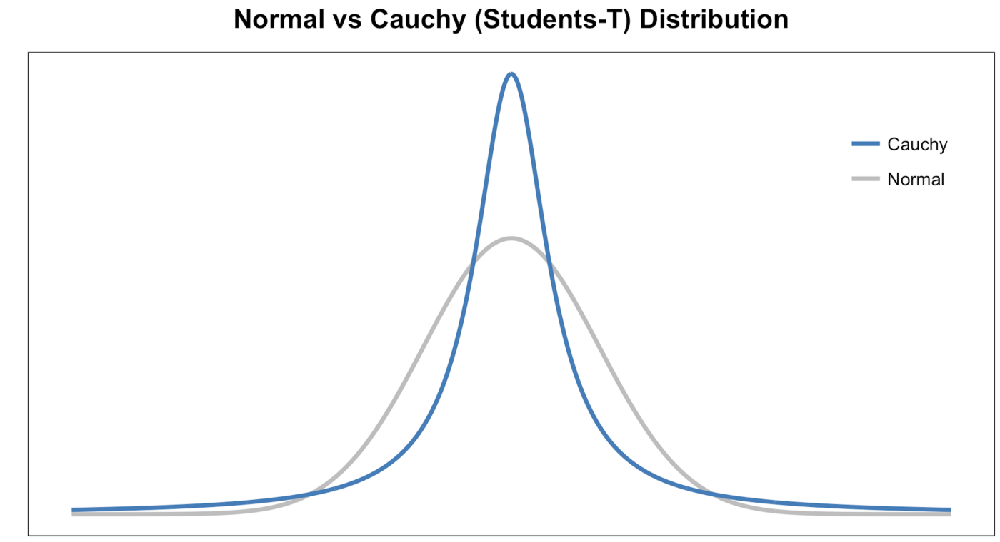

# t-Distributed Stochastic Neighbor Embedding\(t-SNE\)

t-SNE, unlike PCA, is not a linear projection. It uses the **local relationships** between points to create a low-dimensional mapping. This allows it to capture **non-linear structure**.

> Both advantage as well as the drawback of PCA is that it tries to maintain the variance of the data set by casting it in a lower dimension space. But t-SNE’s approach is to map the data points into a lower dimension such that the distance between the points remains the same

There are other methods as well which tries the same thing that t-SNE does, like Local Linear Embeddings, Kernel PCA but t-SNE just performs better in practice.

## How does it work?

The t-SNE algorithm calculates a similarity measure between pairs of instances in the high dimensional space and in the low dimensional space. It then tries to optimize these two similarity measures using a cost function.

* **Step1**: **measure similarities between points in the high dimensional space**.

  For each data point \(xi\) we’ll center a Gaussian distribution over that point. Then we measure the density of all points \(xj\) under that Gaussian distribution. Then renormalize for all points. This gives us a set of probabilities \(Pij\) for all points. Those probabilities are proportional to the similarities. All that means is, if data points x1 and x2 have equal values under this gaussian circle then their proportions and similarities are equal and hence you have local similarities in the structure of this high-dimensional space. The Gaussian distribution or circle can be manipulated using what’s called perplexity, which influences the variance of the distribution \(circle size\) and essentially the number of nearest neighbors. Normal range for perplexity is between 5 and 50.

* **Step2**: **Measure similarity in lower dimension space**:

  It is similar to step 1, but instead of using a Gaussian distribution you use a Student t-distribution with one degree of freedom, which is also known as the Cauchy distribution .

  This gives us a second set of probabilities \(Qij\) in the low dimensional space. As you can see the Student t-distribution has heavier tails than the normal distribution. The heavy tails allow for better modeling of far apart distances.

  

* **Step3**: **Use regression to optimize the similarity loss function**.

  The last step is that we want these set of probabilities from the low-dimensional space \(Qij\) to reflect those of the high dimensional space \(Pij\) as best as possible.

  We want the two map structures to be similar. We measure the difference between the probability distributions of the two-dimensional spaces using Kullback-Liebler divergence \(KL\). Finally, we use gradient descent to minimize our KL cost function.

