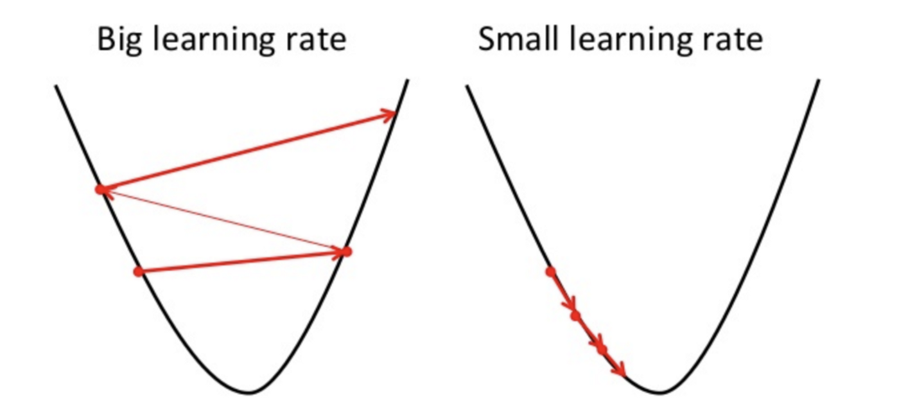
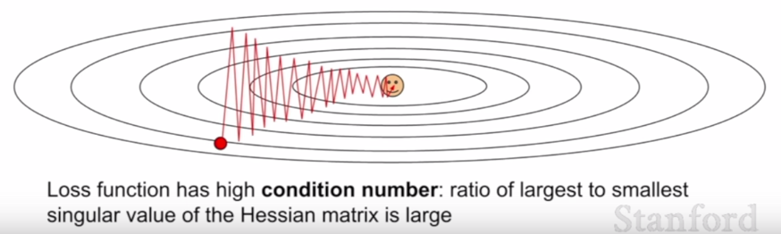

# Stochastic Gradient Descent

SGD or the stochastic gradient descent is the simplest optimization algorithm.

Apparently, for gradient descent to converge to optimal minimum, cost function should be [convex](https://www.researchgate.net/post/What_is_the_difference_between_convex_and_non-convex_optimization_problems). 

## Goal

The goal for optimization algorithm is to find parameter values which correspond to minimum value of cost function. 

## Process

Specifically, gradient descent starts with calculating gradients (derivatives) for each of the parameter w.r.t cost function. Those gradients gives us numerical adjustment we need to make to each parameter so as to minimize the cost function. This process continues until we hit the local/global minimum (cost function is minimum w.r.t it’s surrounding values).

## Main Operation

$$\Large parameters = current\_param\_values - \alpha \times param\_gradients$$

## Parameters

### Learning Rate ($\bold{\alpha}$)

*Learning rate* defines how much parameters should change in each iteration.

## Advantages

- Easy to implment
- Fast

## Disadvantages

### Parameter Sensitivity

SGD makes slow progress towards less sensitive direction and more towards high sensitive one and hence does not align in the direction of minimum. In practice, deep neural network could have millions of parameters and hence millions of directions to accommodate for gradient adjustments and hence compounding the problem.

### Local Minima

Another issue with SGD is problem of local minimum or [saddle points](https://en.wikipedia.org/wiki/Saddle_point). Saddle points are points where gradient is zero in all directions. Consequently, our SGD will be stuck there only. On the other hand, local minimums are point which are minimum w.r.t surrounding however not minimum over all. As gradient will be zero at local minimum our gradient descent would report it as minimum value when global minimum is somewhere else.