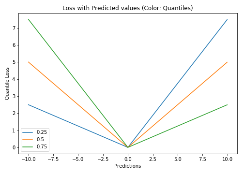

# Quantile Loss

## Mathematical Function

$$\LARGE L_{\gamma}(y,y^p) = \sum_{i=y_i<y_i^p}(\gamma -1)|y_i - y_i^p| + \sum_{i=y_i\geq y_i^p}(\gamma)|y_i - y_i^p|$$

## Explanation

As the name suggests, the quantile regression loss function is applied to predict quantiles. For a set of predictions, the loss will be its average.

[Quantile loss function](https://towardsdatascience.com/deep-quantile-regression-c85481548b5a) turns out to be useful when we are interested in predicting an interval instead of only point predictions.

