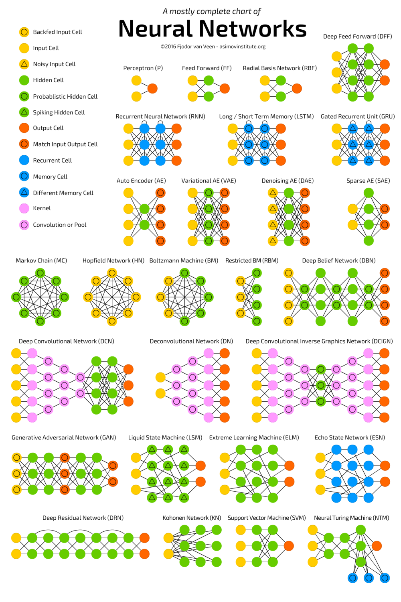

# Types of Neural Network

## Feed Forward Neural Network

This is one of the simplest types of artificial neural networks. In a feedforward neural network, the data passes through the different input nodes till it reaches the output node.

In other words, data moves in only one direction from the first tier onwards until it reaches the output node. This is also known as a front propagated wave which is usually achieved by using a classifying activation function.

Unlike in more complex types of neural networks, there is no backpropagation and data moves in one direction only. A feedforward neural network may have a single layer or it may have hidden layers.

## Radial Basis Function(RBF) Neural Network

A radial basis function considers the distance of any point relative to the centre. Such neural networks have two layers. In the inner layer, the features are combined with the radial basis function.

The radial basis function neural network is applied extensively in power restoration systems. In recent decades, power systems have become bigger and more complex.

This increases the risk of a blackout. This neural network is used in the power restoration systems in order to restore power in the shortest possible time.

## Multi Layer Perceptron(MLP)

A multilayer perceptron has three or more layers. It is used to classify data that cannot be separated linearly. It is a type of artificial neural network that is fully connected. This is because every single node in a layer is connected to each node in the following layer.

This type of neural network is applied extensively in speech recognition and machine translation technologies.

## Convolution Neural Network(CNN)

A convolutional neural network(CNN) uses a variation of the multilayer perceptrons. A CNN contains one or more than one convolutional layers. These layers can either be completely interconnected or pooled.

Before passing the result to the next layer, the convolutional layer uses a convolutional operation on the input. Due to this convolutional operation, the network can be much deeper but with much fewer parameters.

Due to this ability, convolutional neural networks show very effective results in image and video recognition, natural language processing, and recommender systems.

Convolutional neural networks also show great results in semantic parsing and paraphrase detection. They are also applied in signal processing and image classification.

## Recurrent Neural Networks(RNN)

A Recurrent Neural Network is a type of artificial neural network in which the output of a particular layer is saved and fed back to the input. This helps predict the outcome of the layer.

From each time-step to the next, each node will remember some information that it had in the previous time-step. In other words, each node acts as a memory cell while computing and carrying out operations. The neural network begins with the front propagation as usual but remembers the information it may need to use later.

This type of neural network is very effective in text-to-speech conversion technology.  Here’s what a recurrent

## Long Short Term Memory(LSTM)

Long Short-Term Memory (LSTM) is a specific recurrent neural network (RNN) architecture that was designed to model temporal sequences and their long-range dependencies more accurately than conventional RNNs

LSTM does not use activation function within its recurrent components, the stored values are not modified, and the gradient does not tend to vanish during training. Usually, LSTM units are implemented in “blocks” with several units. These blocks have three or four “gates” (for example, input gate, forget gate, output gate) that control information flow drawing on the logistic function.

## Modular Neural Network

A modular neural network has a number of different networks that function independently and perform sub-tasks. The different networks do not really interact with or signal each other during the computation process. They work independently towards achieving the output.

As a result, a large and complex computational process can be done significantly faster by breaking it down into independent components. The computation speed increases because the networks are not interacting with or even connected to each other.  

## Sequence to Sequence Models

A sequence to sequence model consists of two recurrent neural networks. There’s an encoder that processes the input and a decoder that processes the output. The encoder and decoder can either use the same or different parameters. This model is particularly applicable in those cases where the length of the input data is not the same as the length of the output data.  

Sequence-to-sequence models are applied mainly in chatbots, machine translation, and question answering systems.

