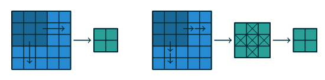
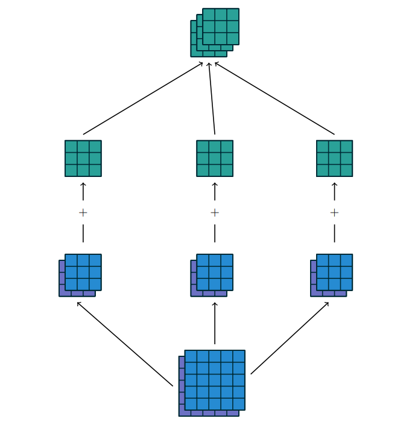

# Arithmatics of CNN

## Introduction

> **Affine Transformations**:
>
> A vector is received as an input and is multiplied with a matrix to produce an output.

Basic Input:

- Multi dimensional arrays

- The ordering of these axes matter

  eg: For an image 1st axis is the width and 2nd is the height

- 1 of the axis is the channel axis and is used to access different views of the data

  eg: 3 channels for a RGB image(each channel having R,G,B input of the image)

### Discrete Convolution

These properties are not exploited when an affine transformation is applied; in fact, all the axes are treated in the same way and the topological information is not taken into account. Still, taking advantage of the implicit structure of the data may prove very handy in solving some tasks, like computer vision and speech recognition, and in these cases it would be best to preserve it. This is where discrete convolutions come into play. 

> A discrete convolution is a linear transformation that preserves this notion of ordering. It is sparse (only a few input units contribute to a given output unit) and reuses parameters (the same weights are applied to multiple locations in the input).

**Feature Map**: Each channel of the input is called as a feature map.

The collection of kernels defining a discrete convolution has a shape corresponding to some permutation of (n, m, k~1~, . . . , k~N~ ), where 

n ≡ number of output feature maps, 

m ≡ number of input feature maps, 

k~j~ ≡ kernel size along axis j.

The following properties affect the output size o~j~ of a convolutional layer along axis j: 

- i~j~ : input size along axis j, 
- k~j~ : kernel size along axis j, 
- s~j~ : stride (distance between two consecutive positions of the kernel) along axis j, 
- p~j~ : zero padding (number of zeros concatenated at the beginning and at the end of an axis) along axis j.

**Note** that strides constitute a form of subsampling. As an alternative to being interpreted as a measure of how much the kernel is translated, strides can also be viewed as how much of the output is retained. For instance, moving the kernel by hops of two is equivalent to moving the kernel by hops of one but retaining only odd output elements

Fig: Explanation of stride = 2 or odd output elements

 

Fig: 2 input feature map convoluted to 3 output feature map using 3 kernels

Blue matrix: input feature map

Violet matrix: Kernel

Green matrix: output feature map

### Pooling

Pooling operations reduce the size of feature maps by using some function to summarize subregions, such as taking the average or the maximum value.

In some sense, pooling works very much like a discrete convolution, but replaces the linear combination described by the kernel with some other function. 

The following properties affect the output size o~j~ of a pooling layer along axis j:

- i~j~ : input size along axis j,
- k~j~ : pooling window size along axis j,
- s~j~ : stride (distance between two consecutive positions of the pooling window) along axis j.

## Convolution Arithmetic

The analysis of the relationship between convolutional layer properties is eased by the fact that they don’t interact across axes, i.e., the choice of kernel size, stride and zero padding along axis j only affects the output size of axis j.

Same padding is also known as **Half Padding**

— Output has same dimension as the input

Valid padding is also known as **No Zero Padding**

— No padding i.e Ouput has lesser dimension than input

More padding is also known as **Full Padding**

— Extra padding i.e. Output has bigger dimension than input

$$\begin{equation}\LARGE Output\ dimension = \lfloor\frac{n + 2p - k}{s}+1\rfloor\end{equation}$$

## Transposed Convolution

The need for transposed convolutions generally arises from the desire to use a transformation going in the opposite direction of a normal convolution, i.e., from something that has the shape of the output of some convolution to something that has the shape of its input while maintaining a connectivity pattern that is compatible with said convolution. For instance, one might use such a transformation as the **decoding layer of a convolutional autoencoder** or to **project feature maps to a higher-dimensional space**.