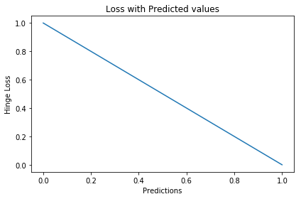

# Hinge Loss

## aka Multi class SVM Loss

## Mathematical Formula

$$\LARGE SVM \ \ Loss = {\sum_{j\not = y_i} max(0, s_j - s_{y_i} + 1)}$$

## Explanation

In simple terms, the score of correct category should be greater than sum of scores of all incorrect categories by some safety margin (usually one). And hence hinge loss is used for [maximum-margin](https://link.springer.com/chapter/10.1007/978-0-387-69942-4_10) classification, most notably for [support vector machines](https://en.wikipedia.org/wiki/Support_vector_machine). Although not [differentiable](https://ipfs.io/ipfs/QmXoypizjW3WknFiJnKLwHCnL72vedxjQkDDP1mXWo6uco/wiki/Differentiable_function.html), it’s a convex function which makes it easy to work with usual convex optimizers used in machine learning domain.

> *Hinge Loss not only penalizes the wrong predictions but also the right predictions that are not confident. It is primarily used with SVM Classifiers with class labels as -1 and 1. Make sure you change your malignant class labels from 0 to -1.*

