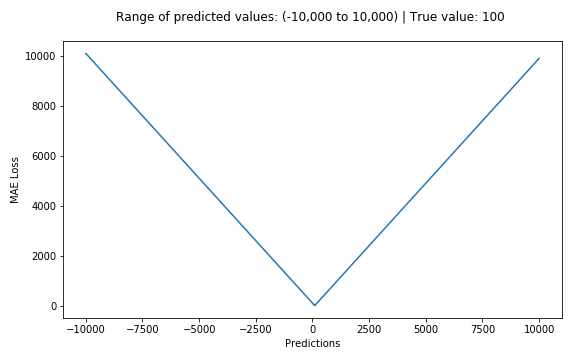

# Mean Absolute Error or L1 Loss

## aka MAE, L1 Loss

## Mathematical Formula

$$\LARGE MAE = \frac{\sum_{i=1}^n|y_i - \hat{y}_i|}{n}$$

## Explanation

_Mean absolute error_, on the other hand, is measured as the average of sum of absolute differences between predictions and actual observations. Like MSE, this as well measures the magnitude of error without considering their direction. Unlike MSE, MAE needs more complicated tools such as linear programming to compute the gradients. Plus MAE is more robust to outliers since it does not make use of square.

