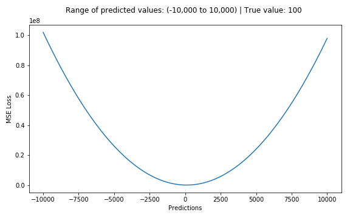

# Mean Square Error or L2 Loss

aka MSE, L2 Loss or Quadratic Loss

## Mathematical Formula

$$\LARGE MSE = \frac{\sum_{i=1}^n(y_i - \hat{y}_i)^2}{n}$$

## Explanation

It’s only concerned with the average magnitude of error irrespective of their direction. However, due to squaring, predictions which are far away from actual values are penalized heavily in comparison to less deviated predictions. Plus MSE has nice mathematical properties which makes it easier to calculate gradients.

