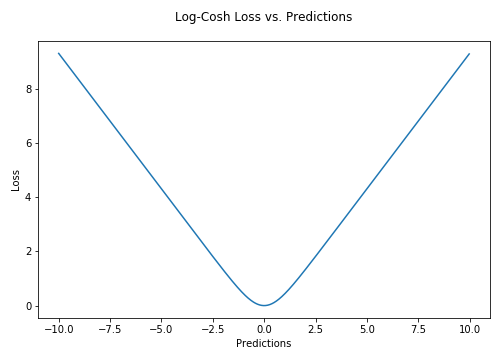

# Log Cosh Loss

## Mathematical Formula

$$\LARGE L(y, y^P) = \sum_{i=1}^{n}(cosh(y^P_i - y_i))$$

## Explanation

The Log-Cosh loss function is defined as the logarithm of the hyperbolic cosine of the prediction error.  It is another function used in regression tasks which is much smoother than MSE Loss. 

It has all the advantages of Huber loss, and it’s twice differentiable everywhere, unlike Huber loss as some Learning algorithms like XGBoost use Newton’s method to find the optimum, and hence the second derivative (*Hessian*) is needed.

> `*log(cosh(x))*` *is approximately equal to* `*(x ** 2) / 2*` *for small* `*x*` *and to* `*abs(x) - log(2)*` *for large* `*x*`*. This means that ‘logcosh’ works mostly like the mean squared error, but will not be so strongly affected by the occasional wildly incorrect prediction.
> —* [*Tensorflow Docs*](https://www.tensorflow.org/api_docs/python/tf/keras/losses/logcosh)