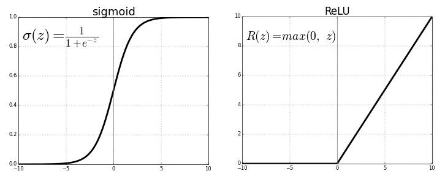

# Activation Function

## Why do we need Activation function?

Lets say we have 1 hidden layer and there are no activation function in either the hidden layer and output layer. In this scenario the Feed forward propagation will look something like this:

Data at layer 1:

- $A_1 = Z_1 = A_0^T \cdot W_1$

Data at output layer: 

- $$
  \begin{aligned}
A_2 = Z_2 = & A_1^T \cdot W_2 \\
= & (A_0^T \cdot W_1) \cdot W_2 \\
= & A_0^T \cdot W_{12}
\end{aligned}
  $$

Where $W_{12}$ is the matrix multiplication of $W_1$ and $W_2$.

Here we can see that the output is a linear function of the input i.e. output is basically a scaled version of the input.

This representation is very is not powerful enough to capture a complex relation between the input and output. To solve this issue, we introduce the activation function at each layer. Usually the activation functions are non-linear and transform the input non-linearly. This results in a complex polynomial relation between the input and the output, thus powerful enough to capture real world patterns.

## Popular Activation Functions

Here are some popular activation functions.

We can always create our own activation functions, but to get started training a new model before we tweak it, we can use these  activation functions which are already implemented in many neural network frameworks.

> Note: Even though activation functions are used to introduce a non-linearity, we can have a linear parts in our activation function. As long as it is introducing a non-linearity, it should be fine.

Another thing to understand here is that our activation functions 

> should be differentiable in the range that spans our input features

The whole function if not differentiable, its fine as long as it is differentiable in the range of our input features, thus backpropagation can be easily used.

#### 1. Binary Activation Fn

#### 2. Sigmoid function

$$
f(x) = \frac{1}{1 + e^{-x}}
$$

As we can see in the graph that the output of the function always lies in the range [0, 1] for all the input values.

Advantages:

- **Range is bounded**: the output value is always in the range [0,1]

- **Function is fully differentiable** 

Disadvantages:

- **Vanishing gradient**: i.e. for very high or low value of x the function gives the same value thus not able to differentiate between different extreme values of x. Thus the gradients for these values, are hardly noticable and so it does not contribute a huge value during backpropagation.

- **Computationally expensive**

- **Not centered at 0**: i.e. for x = 0, the function still gives a +ve value, thus adding a weight to the prediction where it shouldn't have added. 

- **Slow convergence**: Due to vanishing gradients, the gradients for extreme values of x are very close to 0, thus the node doesnt converge to a proper value in less itterations.

#### 3. Tanh function

$$
\begin{aligned}
tanh(x) & = 2 \times sigmoid(2x) - 1 \\
& = \frac{2}{1 + e^{-2x}}-1
\end{aligned}
$$

Here the output always lies in the range [-1, 1] for all inputs of x.

Advantage:

- **Centered at 0**

- **Fully differentiable**

Disadvantages:

- **Vanishing Gradients**

- **Slow convergence**

#### 4. ReLU

$$
f(x) = max(0,x)
$$

> ReLU stands for Rectified Linear Unit

Here for -ve values of x it is always 0 and for positive values of x it gives us x, thus the range is [0,x].

> mportant thing to note here is that the function is not differentiable at $x = 0$, so as long as our input doesnt include 0, we can easily use this function as our activation function and use backpropagation.

Advantages:

- Computationally efficient

Disadvantage:

- **Dying ReLU problem**: i.e. when x approaches 0 or -ve values the gradient doesnt differentiate among them and outputs 0 and also the gradient of the function becomes 0. So it becomes difficult for the model to map -ve values properly.

#### 5. Leaky ReLU

One big issue with ReLU was that it used to deactivate the node for any value of $ x \le 0$. This is solved using leaky relu which gives a small value for $x \le 0$ and x for $x > 0$.

This function is also not differentiable at x, but as it deactivates the node for x = 0, we will not have an issue in backpropagation.

$$
f(x) = 
\begin{cases}
x &; x >0 \\
0.01x &; x \le 0
\end{cases}
$$

We can also use a parameter rather than just 0.01 as the multiple for -ve values of x. In this case this parameter will be another hyperparameter which we can use to tune our model.

Advantage:

- **Prevents Dying ReLU problem**

Disadvantage

- **Result is not consistent for -ve values**: The extent weight that gets added for  +ve values are way more than what get added for  -ve values, thus for -ve values, it does not map datas properly.

- **Overshooting Neuron**: as the function is linear for x>0, the function can overshoot for very high values of x

#### 6. Exponential Liner Unit

$$
f(x) = 
\begin{cases}
x &; x \ge 0 \\
a(e^x - 1) &; x < 0
\end{cases}
$$

This function solves the issues of differentiation with leaky and regular relu at x = 0. This function is fully differentiable for all values of x.

> Note: here we are use $a$ as a hyperparameter rather than providing a hardcoded constant.   

#### 7. Softmax

$$
f(x) = \frac{e^x_i}{\sum_i e^x_i}
$$

Here the output of the function is fully dependent on the values of the other outputs in the same layer, thus the bounds even though [0,1] the values calculated with relative to each other, thus scaling the values appropriately.

Advantages:

- Can handle multiple classes: i.e. the concept of class was not present in other activation functions, thus they can only predict values for 1 class.

- Mainly useful for classification in output neurons.

## How to choose Activation Functions?

- Sigmoid is generally good for classification

- In most cases Sigmoid and Tanh are avoided because of vanishing gradients.

- ReLU is widely used and is usually the default option

- Leaky ReLU helps if we are facing dying neuron problem.

- ReLU should only be used for hidden layers.

- Output for regression problems can have a linear activation function

# Reference

[1]: https://medium.com/@snaily16/what-why-and-which-activation-functions-b2bf748c0441

[2]: https://www.analyticsvidhya.com/blog/2020/01/fundamentals-deep-learning-activation-functions-when-to-use-them/ [Activation Functions | Fundamentals Of Deep Learning]

[3]: https://towardsdatascience.com/activation-functions-neural-networks-1cbd9f8d91d6
