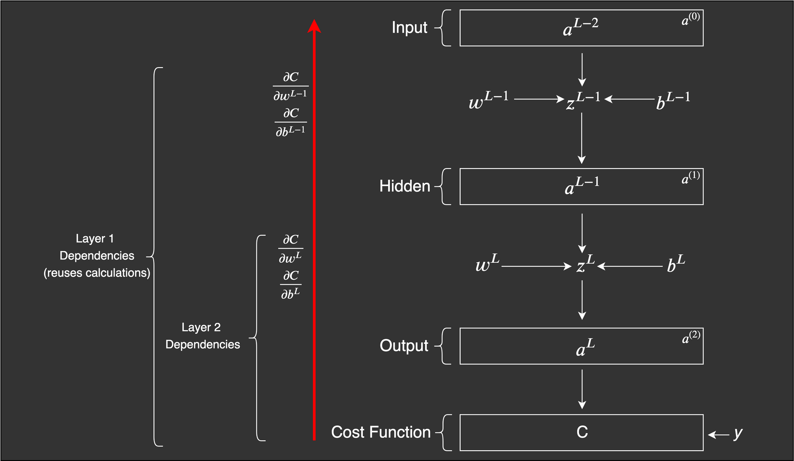

# Backpropagation In neural Networks

As stated, the operations needed to be performed to find the rate of change of error/cost/loss with respect to the weights are performed by the Backpropagation algorithm. The result is then plugged into the optimization algorithm to update the weights and biases.

Basic Forward propagation for any layer $l$ looks like as follows:

$$
\begin{aligned}
Z^l &= (A^{l-1})^T * W + b &\text{ Z holds the data for the layer l} \\
A^l &= g(Z^l) &\text{ where g is the activation fucntion for layer l}
\end{aligned}
$$

Thus we can derive the backward propagation as:

$$
\begin{aligned}
\frac{\partial Loss}{\partial W_L} &= \frac{\partial F(A_L)}{\partial W_L} &\text{where F(z) is the loss function} \\
&= \frac{\partial F(A_L)}{\partial A_L} \frac{\partial A_L}{\partial W_L} \\
&= \frac{\partial F(A_L)}{\partial A_L}\frac{\partial g(Z_L)}{\partial W_L} \\
&= \frac{\partial F(A_L)}{\partial A_L}\frac{\partial g(Z_L)}{\partial Z_L}\frac{\partial Z_L}{\partial W_L} \\
&= \frac{\partial F(A_L)}{\partial A_L}\frac{\partial g(Z_L)}{\partial Z_L}\frac{\partial (A_{L-1}^T * W_L +b)}{\partial W_L} \\
&= \frac{\partial F(A_L)}{\partial A_L}\frac{\partial g(Z_L)}{\partial Z_L}A_{L-1} \\
&= \frac{\partial F(A_L)}{\partial A_L}g'(Z_L)A_{L-1} \\
&= F'(A_L)g'(Z_L)A_{L-1}
\end{aligned}
$$

We can perform the similar backpropagation process for other layers as well. So in general we can say that for other layers $l$ we will have:

$$
\frac{\partial Loss}{\partial W_l} = F'(A_L)g'(Z_L)*g'(Z_{L-1})*...*A_l
$$

Similarly we can have for bias as:

$$
\frac{\partial Loss}{\partial b_l} = F'(A_L)g'(Z_L)*g'(Z_{L-1})*...*g'(Z_l)
$$

# Reference

[1]: <ML from Scratch>"[Neural Networks: Feedforward and Backpropagation Explained](https://mlfromscratch.com/neural-networks-explained)"
