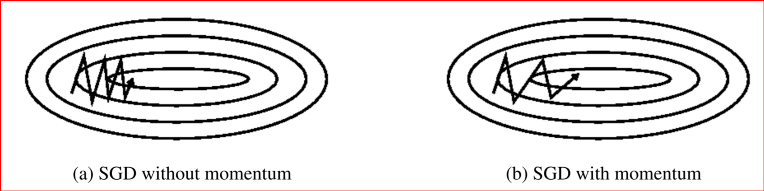
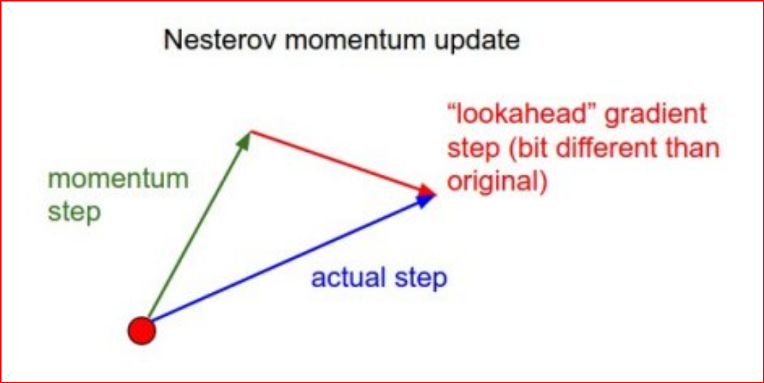

# Optimization Algorithm

Optimization Algorithm is the crux of a neural network model using in supervised learning. This algorithm takes input the loss, weights, biases, certain hyperparameters like learning rate and then tries to minimize the loss function by changing weights and biases. This change in weights and biases are governed by the learning rate and other hyperparameters used by the optimization algorithm.

Without the optimization algorithm, we wouldn't know how much and in which way should we change the weights such that the loss can be decreased.

> Mostly optimization algorithms only dictates the type of change and the degree of change required but the actual change is made by the Backpropagation algorithm. Here we will cover the optimization algorithm leaving the backpropagation for the next section.

Some important Jargons:

- Batch: the no of input considered at a time for evaluating the cost function to update the weights is known as a batch. This batch can be either 1 (stochastic grad desc) or more than 1 but less than the whole input thus dividing the input into multiple batches(Mini batch grad desc) or the whole input (Batch grad desc).

- Epoch: this represents the no of times we will go through the data for calculating cost and updating the weight.
  
  If the batch size is 1, then in each iteration we go through all the data one by one. If the batch size is less than the no of input data, we go through the batches one by one which inside it holds multiple data rows. If the batch size is equal to the input number, we go through the whole input at once in each iteration.

## Gradient Descent

It is one of the famous type of optimization algorithm, where we itteratively update our weights to get to the closest minimum cost value.

The extend of the change of weights is governed by many factors and the basic factor being the "rate of change of loss function with respect to weights" i.e $\Large \frac{df(x)}{dW}$   or also denotes as $J(W)$ or also known as the Jacobian of weights.

As we use a gradient(differential of cost vs weights) here, thus getting its name Gradient descent. The value of the gradient is calculated using the Backpropagation method.

$$
W = W - f(J(W))
$$

where 

- W is the weights of the neural network

- f(z) is the optimization algorithm to find a value to subtract from weight

- $J(W)$ is the rate of change of cost function with respect to weights

Based on how many input we use to find the cost function i.e. no of rows we consider through the forward propagation and then calculate the cost function, we can divide Gradient Descent into 3 categories:

- **Mini Batch Gradient Descent**: Here we use a small batch of the input at once to calculate the cost function and thus the input is divided into many batches and we try to update the weights going over each batch multiple times.

- **Stochastic Gradient Descent(SGD)**: Here we use only 1 input row at a time and update weights by going over each input multiple times.

- **Gradient Descent**: Here we go over the whole input at once to calculate an average cost function and then update the weights by going over the whole input multiple times.

- 

### Simple Gradient Descent

A simple grad desc algorithms does the following:

- For each epoch do the following:
  
    - For each batch do the following:
      
        - Calculate or get the loss value, weights and learning rate($\alpha$).
      
        - Find the $J(W)$ using backpropagation.
      
        - Update the weight as follows:

$$
W = W - \alpha*J(W)
$$

- Return or state the newly updated weights after completion of all epochs.

Here the batch size can be any value from 1 to n, where n is no of input rows. Usually the batch size is taken as a multiple of 2 like 32, 63, 128 etc.

If looked closely, the complexity of  the above algorithmalogrithm

alogrithm

alogrithm is $O(epochs*batch\_num)$ 

where epochs is the number of epochs considered and batch_num  is the number of batches.

- If we take batch size as 1, the complexity become $O(epochs*n)$ and thus as the number of input increases, the complexity also increase.

- But if we take the whole input as the batch the complexity turns out to be $O(epochs)$ and thus the quality of output i.e. the surety that the weights will predict correct values in validation set or train set or in real world scenarios, greatly depends on the number of epochs we train on. Thus the no of epochs to get to a specific level of correctness increases. Another issue here is that the calculation of loss value over the whole input and calculation of the derivative also increases as we are now considering the whole input. Even though this increase is not linear as in the case of SGD, but it is still considerable if our data input it too huge. 

- Thus we try to use batches of input as the middle ground. The complexity then becomes $O(epochs*b)$, where b is the number of batches present. Here we neither need a lot of epochs nor does the derivative and loss calculations slow down as the batch size is comparatively small. The number of batches even though depends on the number of input, but guessing a good batch size can always speed up the process.

### GD with Momentum

Using momentum terms basically speeds up the GD process.

As shown in the figure, the grad desc algorithm makes jumps towards the minima but the jumps are not properly aligned towards the minima. Sometimes the component towards the minima is less and the other components are more thus even though the weights get updated to yield better loss value, the algorithm would have done better if the change was big in the required components and less in the other  components. 

> This issue mainly comes in scenarios where the certain components have a skewed scale as shown in the figure above. In place of a near spherical shape, it resembles more with an oval shape thus making changes in y-axis has a greater impact.

> The different thing about GD with Momentum is that it uses the weighted value of the previous $J(W)$.

$$
W = W - (\gamma(J_{i-1}(W)) + \alpha J(W)) \text{ for itteration i}
$$

As we can see here that the jacobian of the previous iteration denoted as $J_{i-1}(W)$ is added and the whole value is then subtracted from the weights.

The jacobian of the previous iteration cancels out the change in other directions and boosts the change in correct directions.

Disadvantage:

- Even though momentum speeds up the process by taking higher jumps compared to ged desc, but sometimes it might miss the minima by making a huge jump and thus crossing the minima.

### NAG

aka **Nesterov Accelerated Gradient.**

Momentum may be a good method but if the momentum is too high the 
algorithm may miss the local minima and may continue to rise up. So, to 
resolve this issue the NAG algorithm was developed.

Here the concept of looking ahead is used to know when to increase the extent of the jump and when to decrease it based on whether it is approaching the minima or not.

$$
W_i = W_{i-1} - v_i \\
v_i = \gamma V_{i-1} + \alpha J_i(W_{i+1}) \\
W_{i+1} = W_i - \gamma v_{i-1} \text{ ;guessed look ahead}
$$

### Adagrad

One main issue with grad desc and grad desc with momentum is that the learning rate has to be tuned to get the best performance and this is a very expensive task, as it requires to perform the training process multiple times to guess the correct value.

In adagrad, the learning rate changes according to the changes required. In initial state it will have large changing rates and with the achieving minima, the rate is decreased so that we dont miss the minima.

To achieve this we use a the sum of previous gradients in place of just the 1 previous gradient as in the case of gred desc with momentum. Here is the updation equation:

$$
W_i = W_{i-1} - \frac{\alpha}{\sqrt{\sum_t J_t(W) + \epsilon}}J(W_i) 
$$

Here, the term $\sum_tJ_t(W)$ is the summation of all the gradients upto the current iteration. The constant term $\epsilon$ is added so that if the gradient sum somehow turns to be 0, we can still perform the above operations easily. $\epsilon$ is a very small constant, used to maintain a non 0 denominator.

Advantage:

- Works well on small or very sparse data i.e. data doesn't span a lot over the area and mostly is clustered at specific location.

Disadvantage

- **Diminishing Learning Rate**: The main issue with Adagrad is that it decreases the learning rate to very great extent as we approach the minima. Even though it speeds up the process by quickly trying to achieve the minima, but as we get closer, the denominator increases and thus the learning rate diminishes to a great lenght.

### Adadelta

Adadelta is an extension of the Adagrad optimization algorithm. In place of minimizing the learning rate to a great extent when approaching the minima, it bounds the learning rate and only decreases the rate within a specified bound.

This is achieved by bounding the sum of previous iteration griadients that it uses to reduce the learning rate.

> In Adadelta we dont mention the learning rate, it is automatically set as follows:

$$
W_i = W_{i-1} + \triangle J_i{W} \\
 --\\
\triangle J_i(W) = - \frac{RMS[\triangle \sum_t J_t(W)]_{i-1}}{RMS[J_i(W)]} J_i(W)
$$

### RMS Prop

aka **Root Mean Square Propagation. **

This also tries to resolve the Adagrad's diminishing learning rate porblem by using a moving window on the sum of gradients used for reducing the learning rate.

Here the an exponential decay term is used rather than a simple sum of gradients. Thus the learning rate is changed on it own depending on the parameters.

$$
W_i+1 = W_i - \frac{\alpha}{\sqrt{(1-\gamma)J^2_{i-1}(W) + \gamma J_i(W) + \epsilon}} J_i(W)
$$

Advantage:

- Works well on continuous data or a lot of data

### Adam

aka **Adaptive Moment Estimation.**

This can be seen as a combination of the Adagrad and RMS Prop optimization algorithm. Adam uses exponential gradients like in RMS prop but also keeps exponentially decaying the gradient factor thus imitating Adagrad here. Thus it solves the problem of diminishing learning rate as well.

Advantages:

- Computationally inexpensive

- Solves the diminishing learning rate problem in Adagrad

- Can work on continuous data as well like in RMS Prop

It uses 2 Hyperparameter $\beta_1$ and $\beta_2$ and 2 decaying values to correct the weights in each itteration. Here $\beta_1$ and $\beta_2$ belongs to range $\in [0,1)$

$$
m_i = \beta_1m_{i-1} + (1-\beta_1)J_i(W) \\
v_i = \beta_2v_{i-1} + (1-\beta_2)J^2_i(W)
$$

These are the terms used, which mimics the RMS prop feature of considering the previous gradients in a window.

We now try to decay it using the following:

$$
\hat{m_i} = \frac{m_i}{1 - \beta_1^2} \\
\hat{v_i} = \frac{v_i}{1 - \beta_2^2}
$$

$$
W_i = W_{i-1} - \frac{\alpha \hat{m_i}}{\sqrt{\hat{v_i}  + \epsilon}}
$$

### Difference between each Algorithm

As we can see above that the fastest optimizing algorithm is the Adagrad and RMSProp. Thus Adam which is a combination of the both performs significantly better in most given problems.

# Reference

[1]: <Overview of different optimizers> "https://medium.com/datadriveninvestor/overview-of-different-optimizers-for-neural-networks-e0ed119440c3"
