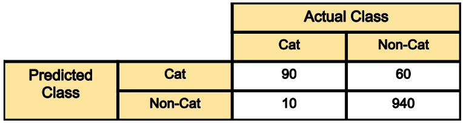

# Performance Metrics

When we are trying to model our data we can end up with a variety of approaches. We can't really predict which approach is best suited for our data or even if we use our experiences and knowledge we might end up with less but still multiple models or with a single model but various hyperparameters to tune for.

In such cases we need some metrics to test the model's performance on test set.

One easy but wrong way to test model is based on its training time. Because some models may take longer to train but might yield better results compared to models training faster.

To compare models on the basis of performance metrics we will need to collect and calculate certain data during the inferring of test data stage.

> Metrics are not the same as the loss function, even though similar metrics are used to assess a model whereas the loss function is used during the training to make changes to the weights.

> Usually metrics are calculated after each epoch.

## Metrics

There are various metrics which we can use based on the situation and type of data and type of problem we are trying to model:

### Regression Problems:

#### 1. Mean Square Error or MSE

It is the same as the loss function MSE. It is the most popular metric for regression model as it gives an overall accuracy of the model.

#### 2. Mean Absolute Error

This is also similar to the loss function counterpart MAE. In scenarios where there might be outliers present in our data MAE works better than MSE.

### Classification Problems:

> Note: These are the cases for a binary classification. In case of a multi class classification, the terms are defined per class i.e. for each class, we associate a score and the correct class in this case denotes the specific class and wrong class denotes any one of the other classes not in consideration.

1. True Positive(TP): when the target denotes a class and the model also predicts the same class correctly then it is counted as a true positive or TP.
2. True Negative(TN): when the target denotes a wrong class and the model also predicts a wrong class then it is counted as true negative or TN.
3. False Positive(FP): when the target denotes a wrong class but the model miss-classifies it as a correct class it is counted as a false positive or FP.
4. False Negative(FN): when the target denotes a correct class and the model miss-classifies it as a wrong class it is counted as a false negative or FN.

#### Confusion Matrix

It is not a metric but very useful in case of Classification problems. It is also known as the **error matrix.**

It is a table which compares the model's prediction with the ground truth of the data.

In the above example, the model's predicted and ground truth of each classification is shown. It gives us a detailed overview about what the model is predicting correctly and incorrectly. This way we can see where the model is lacking and tune it accordingly.

#### 1. Accuracy

This states the accuracy of the model i.e. the no of times it got the correct output. So every time the model makes a correct prediction on the test set, the accuracy increases.

$$
Accuracy = \frac{\#Correct}{\#Test Data} = \frac{TP+TN}{TP+TN+FP+FN}
$$

> According to the above equation accuracy lies in the range [0,1] and the higher the accuracy the better the model.

#### 2. Error Rate

The extent of error made by the model is calculated as the error rate. It is also the opposite of Accuracy i.e. Error Rate + Accuracy = 1.

$$
Error Rate = \frac{\#Incorrect}{\#Test Data} = \frac{FN+FP}{TN+TP+FN+FP}
$$

#### 3. Precision

Precision states the ratio of correct +ve class classification to all the +ve class classification. It is not the same as accuracy because accuracy also accounted for the correct -ve class classification whereas the precision only talks about the  of true positive to all positive classification .

- **When to use**: This metric is very important in scenarios where there is a class imbalance in our training set, i.e. we have more examples of 1 class compared to other. In that scenario, if the model repeatedly predicts the major class, it will still have a great Accuracy but less Precision.

$$
Precision = \frac{TP}{TP+FP}
$$

#### 4. Recall

Recall in place of considering wrong +ve class classification as in the case of Precision, accounts for all the correct positive and negative class classification.

- **When to use**: this is again similar to the precision case, but here we compare against the wrong predictions as well. More useful when we dont want too much of wrong predictions.

$$
Recall =  \frac{TP}{TP+FN}
$$

#### 5. F1-Score

- **When to use:** In scenario when both the precision and recall is important we use the F1-Score metric.
  
  In general a F-$\beta$ score is defined as  
  
  $$
  F_\beta = \frac{(1+\beta^2)}{\beta^2} \frac{precison . recall}{precison + recall}
  $$
  
  $$
  F1-Score = \frac{2(precision.recall)}{precision + recall}
  $$
  
  > Usually we always have a tradeoff between precision and recall. We will in most case either have too high precision and low recall or vice versa.

#### 6. Sensitivity and Specificity

- **When to use**: Mostly used in biological related problems.

$$
\begin{aligned}
Sensitivity  &= Recall &= \frac{TP}{TP+FN} \\
Specificity &= True Negative Rate &= \frac{TN}{TN+FP}
\end{aligned}
$$

#### 7. ROC Curve

Receiver Operating Characteristic Curve is a plot of the true positive rate vs the false positive rate for varying thresholds.

Here the thresholds signify the threshold used to classify the output probability as a positive class. Usually we use 0.5 as the threshold, but in many cases nudging this threshold yields better results.

As we vary the thresholds, we will end up with different labels and thus the precision and recall will vary for each scenario.

- **When to use:** This is mainly used to finding the best threshold which best fits the dataset.

$$
\begin{aligned}
True Positive Rate &= TPR &= \frac{TP}{TP+FN} \\
True Negative Rate &= TNR &= \frac{TN}{TN+FP}
\end{aligned}
$$

#### 8. AUC

The Area Under Curve calculates the area under the ROC curve. 

# Reference

[1]: <https://datascience.stackexchange.com/questions/26854/what-are-useful-evaluation-metrics-used-in-machine-learning> "neural network - What are useful evaluation metrics used in machine learning - Data Science Stack Exchange"

[2]: <https://towardsdatascience.com/20-popular-machine-learning-metrics-part-1-classification-regression-evaluation-metrics-1ca3e282a2ce> "Popular Machine Learning Metrics"

