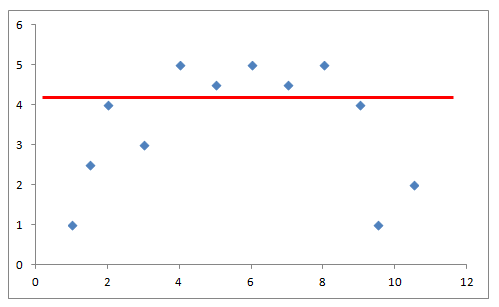
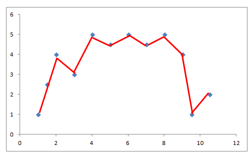
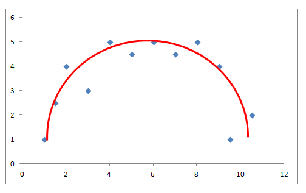

# Bias And Variance

In Neural network we will always face the issue that our model has either high variance or high bias. This issue is known as the bias-variance trade-off.

## Bias

A high bias means that the model's average prediction is too far from the actual true value. This means that the model has not been successful in understanding the pattern in the data set and is usually not susceptible to the variations in the data set.

This usually occurs when the data set has a very complex relation and we try to map that relation using a less complex model. This usually results in poor training performance. This is also referred to as **Underfitting**.

As we can see here the model has not been able to map the variation in the data points thus have a high bias.

## Variance

A high variance is an exact opposite of high bias. Here the model tries to map each and every point in the data set thus performing good to training set but poorly on unseen data points. This results in the model to be sensitive to outliers and noise in the data set.

A high variance model is also not expected as the model is performs poorly on unseen data. This is also termed as **Overfitting.**

## Bias-Variance Trade-off

As stated neither high bias nor high variance is expected from the model. As a result a proper trade-off has to be maintained based on the scenario and dataset. We have to choose the hyperparameters carefully so that the model has a proper balance between bias and variance.

A perfect fit for the above dataset would be something like this:

  

**For low Bias:**

- More no of properly distributed examples usually tends to decrease bias

- More complexity in the model tends to map the dataset well thus reducing bias.

- Increasing the number of iterations helps the model to reach the minimum cost function properly and this tends to decrease bias

**For low Variance:**

- Reducing the complexity of the model tends to decrease the variance.

- Introducing Regularization helps in reducing variance.

- Adding more distributed examples help the model to better understand the dataset thus might help in reducing the variance.

# Reference

[1]: <https://towardsdatascience.com/problem-overfitting-solution-regularization-b466d3d1f4da> "Regularization in Neural networks"
