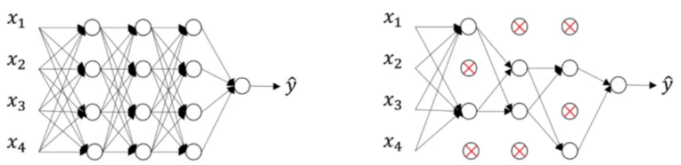

# Regularization

To solve the problem of Overfitting we use the concept of Regularization.

Overfitting happens when the model performs quite good on the training dataset but performs poorly on the validation set. This happens because the model after multiple epochs starts learning the data rather than just the data pattern. This results in the model predicting all correct labels for the training set but when the model is shown a new data set like the validation or test set, it performs poorly, as the model doesn't have any by-hearted data for these new data points.

As the model optimization algorithm's main goal is to reduce the loss it can often lead to overfitting. 

One solution which often works is to reduce the epochs so that the model stops once it learns a pattern and before it starts memorizing the data. This is also achieved through early stopping mechanism where once a threshold is reached the training process is terminated. This threshold can be applied either on the performance metric of the model or on the value of loss. Usually it is applied on the value of the loss.

One best solution which works in most of the cases and is widely used is Regularization. One big reason behind overfitting is model being more complex than needed.

> Regularization penalizes model complexity. 

> Regularization reduces variance without significantly increasing the bias.

Usually the complexity of a neural network depends on the:

- No of nodes in each hidden layer

- No of hidden layers in the NN

To counter both the points we have different kinds of regularization methods.

## L1 and L2 Regularization

L1 and L2 regularization penalizes the weights of each node in each layer. This is done by introducing a regularization term in the cost function which depends on the weights of each layer. 

L1 uses the 1st Norm of the weights($||W||$) where as L2 uses the 2nd Norm of the weights($||W||_2$). The extend of the regularization is controlled using a hyperparameter termed as $\lambda$.

$$
\begin{aligned}
L1\_reg &= ||W|| = |w_1| + |w_2| + ... \\
L2\_reg &= ||W||_2 = |w_1|^2 + |w_2|^2 + ... \\ 
\\
Cost\_Fn &= Loss\_Fn + \frac{\lambda}{2m}(Regularization)
\end{aligned}
$$

The main concept of using L1 and L2 regularization is that the regularization will penalize more if the number of layers are more or the number of nodes are more or the weights used are too high thus the penalty term will be higher and the overall cost will be high. This will cause the optimization algorithm to further reduce the weights to reduce the cost. On the other hand the lesser the values the less will be the regularization term, thus inducing less penalty and the optimization algorithm will less likely aggressively reduce the weights.

## Dropout Regularization

Dropout is another famous regularization method where the nodes are randomly dropped or truncated during the feed forward process. Thus the overall cost of the batch reduces as the dropped nodes don't contribute anything to the prediction thus not contributing anything to the loss function either.

The choosing of the nodes which need to be dropped in each layer are done by assigning a probability to each node in random and using a threshold value. If the probability assigned is greater than the threshold then it is dropped else it is kept as it is and it contributes its weight to the prediction.

The main concept for dropout is that, when certain nodes are dropped out, their weights don't contribute to the prediction and loss value. As a result the weights of the nodes which are considered, their weights gets reduced or we can say their weights get distributed. As a result the overall loss value decreases over the iterations. 

Another way to think about this is that as the nodes which are dropped keeps changing per iteration, the optimization algorithm can't be sure which node's weights it can rely on thus the weights which are required to get a better result it distributed in all the nodes so that the overall performance of the neural network increases.

The hyperparameter introduced by this algorithm is the threshold value which we will have to tune to get better results.

> Note: We don't use the dropout during validation or testing. It is only for reducing the complexity and weights of the neural network during training.

# Reference

[1]: <https://towardsdatascience.com/problem-overfitting-solution-regularization-b466d3d1f4da> "Regularization"

[2]: <https://towardsdatascience.com/how-to-improve-a-neural-network-with-regularization-8a18ecda9fe3> "Regularization in Neural Networks"
