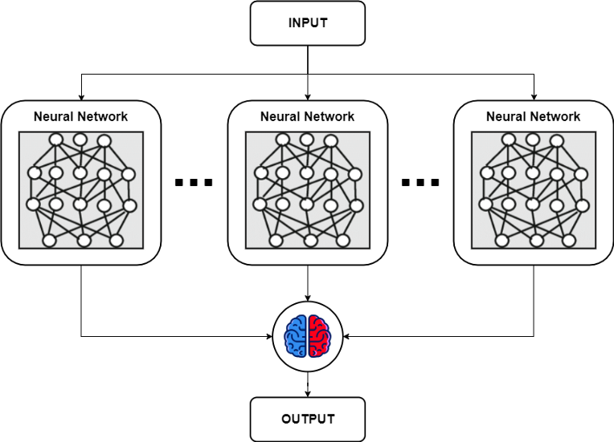

# Ensembling

Ensembling is the process of using more than 1 neural network at the same time to get a better performing overall model. We can mix together multiple models in many ways. 

The main concept of using multiple models together is that some models can have better performance in some scenarios and other can perform better in other scenarios and it is usually expensive and tedious to find a model which can perform well in all the scenarios put together. In such cases we can have multiple models working in parallel and then fusing together their output to get a better result.

## Average Ensembling

# Reference

[1]: <https://towardsdatascience.com/neural-networks-ensemble-33f33bea7df3> "Ensembling in Neural Networks"

