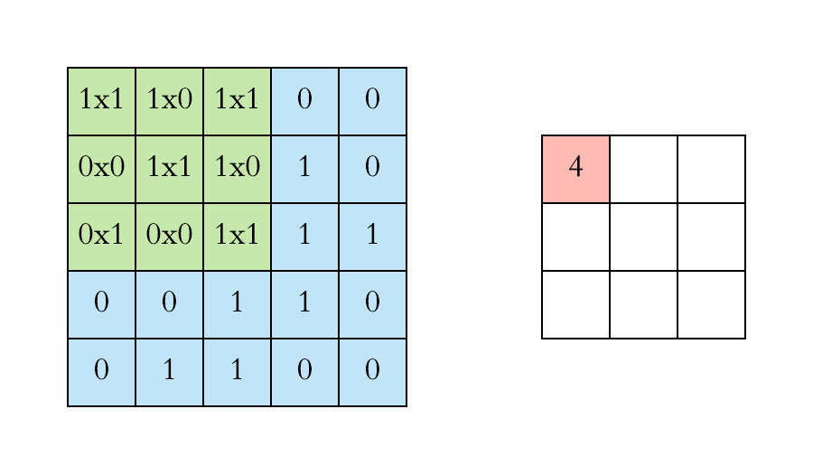
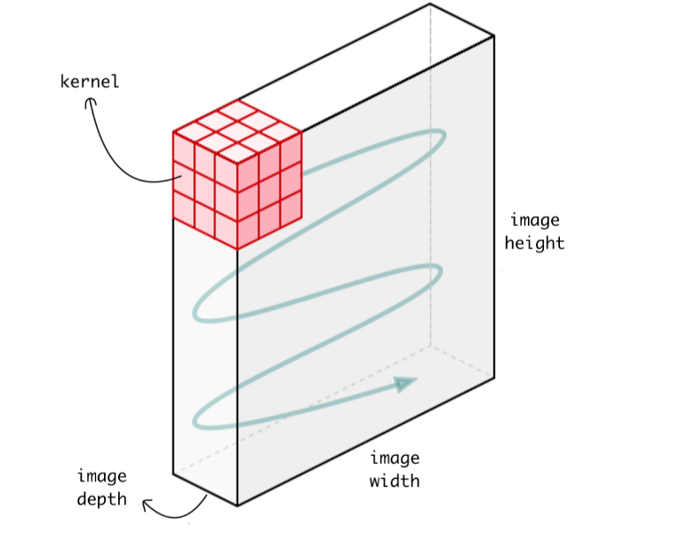
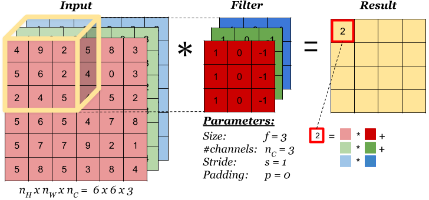
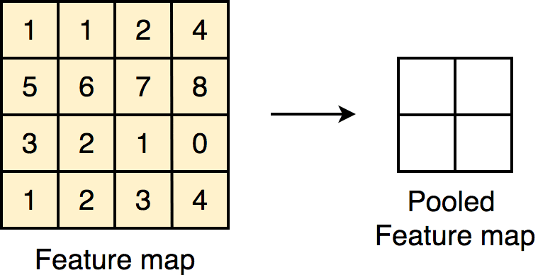
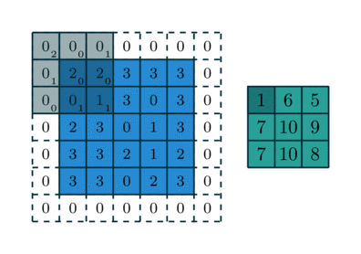
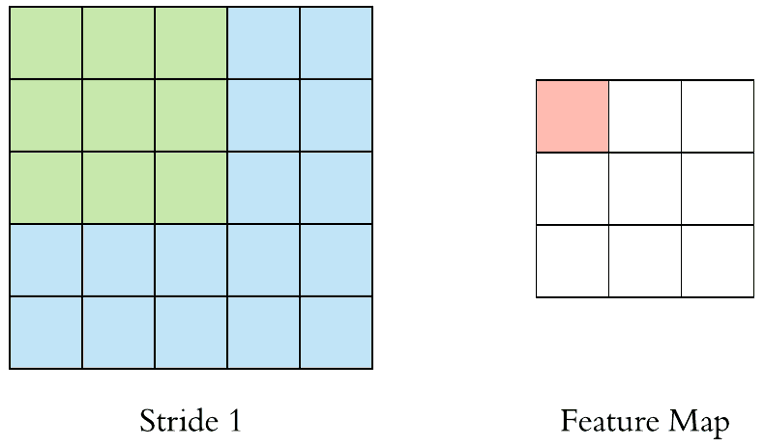
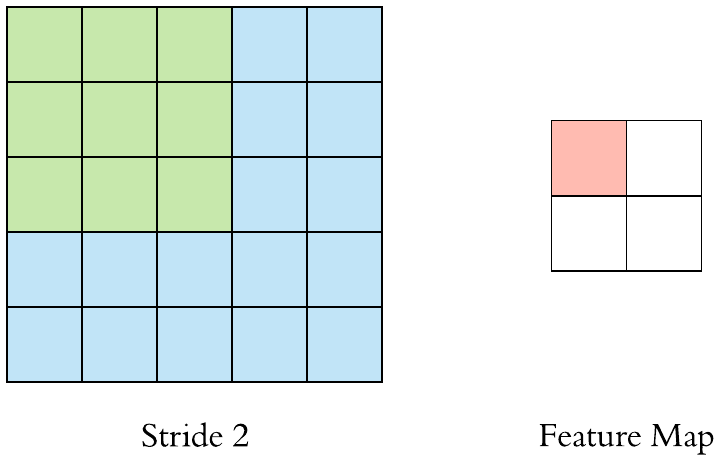
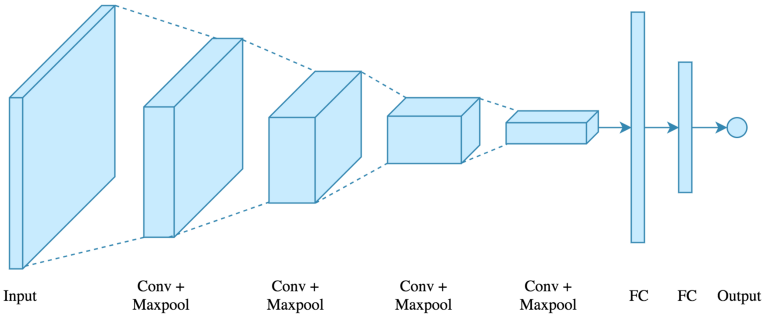

# Convolution Neural Networks

Convolution neural network is similar to the deep neural network in structure and in terms of basic modules but differs in the architecture in general and the node types. We have multiple components in convolution neural network in place of just input, hidden and output layers as in the case of deep neural network.

Differentiating feature of convolution neural networks are:

- Convolution Filter

- Operations
  
    - Convolution operation
  
    - Pooling operation

- Convolution Network

- Fully Connected layers

## Architecture

In general the architecture of a convolution neural network consists of the following:

- Input Layer

- Hidden Layers
  
    - A Convolution Network
  
    - A Fully Connected Network

- Output Layer

### Input

The main differentiating factor for CNN is that it accepts input of higher dimension as opposed to just a single dimension in case of deep neural network. Each data point passed to the network can be a 2D or 3D data and a batch of these data can be passed if we want to perform batch operations. 

### Filters

Filter also known as kernels are similar to the weights in a deep neural network which we try to learn through the learning algorithm and optimization algorithm. Filters usually have a width and a height and the depth depends on the depth of the input data.

In each layer of the Convolution network we slide the filter over the data to produce a single output. These collection of output then forms the data which is used for the next layer.

Unlike weights in neural network, there are multiple filters in a single layer, which work in parallel to generate 1 set in the output. This collection of output sets from each filter is then clubbed together and sent to the next layer.

### Output

The output is similar to that of a deep neural network and all other operations like using a loss function and cost function, label and one hot encoded output are also applicable to CNN.

## The Operations

### Convolution Operation

Convolution operation involves the use of a filter of dimension $w_f\times h_f \times d$ on an input of dimension $w \times h \times d$ . This then produces an output of dimension $(w-w_f+1) \times (h-h_f+1)$.

> Note: The depth of input and the filter is always the same

Here both the filter and the input data are matrices of 3 dimensions. Thus the output produces by the operation is also a 2 dimensional data. Data can also be 2 dimensional, in case of which we use a 2 dimensional filter and output in that case too is a 2 dimensional matrix.

The reason that the output is 2 dimensional in the case of a 3 dimensional data is that the depth of the filter consumes the the depth of the input and this results in only a single digit which can fill only a single cell in the output. This 3 dimensional then traverses the whole input across its width and height and not the depth as the depth of the filter matches that of the input. Thus s 2 dimensional output is generated

The operation involves sliding the filter on top of the input and performing a element wise multiplication of the input and the filter elements which coincide and then adding the values to get 1 single cell in the output.

For  a 2D input the operation would similar to this:

For 3D data

### Pooling Operation

The pooling operation involves performing a function on a selected area of input decided by another filter with dimension $w_p \times h_p \times d_p$ on an input data of dimension $w \times h \times d$ resulting in an output of dimension $(w-w_p+1) \times (h-h_p +1)$ .

The function that has to be performed are usually 1 of these:

- Average

- Max

### Stride and Padding

In the above operations, both the operations involve sliding a filter on the input to get an output. This sliding can be controlled by using the hyperparameter **stride** of the filter. "Stride" controls the jump that the filter will make once its done operating on a single part of the input. If stride = 1, then the window will be 1 cell after each operation, if stride = 2, the window movement will be 2 cell after each operation,and so on. This thus affects the output dimension that the operation produces.

Another hyperparameter that we can use to change the output shape is **padding**. Padding tells how many cells to impute to the boundary of the input data so as to increase the size of the output data and what value should the extra cell contain. 

So when using padding and stride on one of the above operation, the output shape becomes: 

$$
(\frac{w+2p-w_f}{s}+1) \times (\frac{h+2p-h_f}{s}+1)
$$

where $(w_f \times h_f \times d_f)$ is the dimension of the filter,  $p$ is the number of padding cells used and $s$ is the stride of the filter.

## The Convolution Network

The convolution network consists of multiple layers of

- Convolution layer 

- Non Linear Activation Layer

- Pooling layer.

### Convolution Layer

Each Convolution consists of multiple filters and the output of each filter is a 2D data. These are then stacked together to produce a 3D data which is then passed to the activation layer. The depth of the 3D data depends on the number of filters used in the previous layer as each filter contributes one 2D data for the 3D stacked data.

> Note: It is not necessary that the output of each filter will be a 2D data, it can also be a 3D data if the depth of the filter is less than that of the input, but for now we will only consider that the depth is same.

**The number of filter and filter size are the hyperparameters here.**

> Even though in most cases we use CNN for images, we can also use it for other kinds of data.

### Activation Layer

The activation layer takes the input from a convolution layer and performs the activation function on each element. This layer doesnt have any trainable filters and the activation function is mentioned during designing the architecture of the CNN.

### Pooling Layer

The output of the activation layer is then passed to the pooling layer. The pooling layer also consists of multiple filters which then produce multiple outputs which are then stacked together to either pass onto the next convolution layer or a fully connected network. Usually the stride used in pooling layer is 2.

The main purpose of the pooling layer is to decrease the input dimension so that the next convolution layer or the fully connected network has less data to work on. 

The filter function used is not a trainable filter and is provided during the designing of the CNN.

This collection of the 3 layers i.e. Convolution layer, the Activation layer and the Pooling layer is then repeated as a single module. This repetition is then controlled using a hyperparameter.

> Note: The only trainable parameters in the above mentioned layers are the filters used in the convolution layer. Other parameters used are either a hyperparameter or a function mentioned during designing the layer.

## Fully Connected Network

The last section of a CNN is a fully connected Network. This is the same as a deep neural network with a single dimensional input, multiple hidden layers and the same output layer. As a result all the output dependent operations are also applicable to CNN. So we can say that a CNN is basically a Convolution network followed by a Deep Neural Network.

The output the convolution network if in 2 or 3 dimensional format, is first expanded to a single dimensional data, maintaining the batch size and then passed to the fully connected network.

