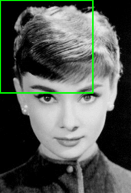

# Classifier Models as Object Detectors

We can use the HOG+SVM techniques to to get the inital start and later use a classifier in place of SVM as object detectors. The process is similar to that of HOG+SVM technique:

- Region Proposal
  
    - Use of Image Pyramids
  
    - Sliding Window

- Classification using CNN

- Non Maximal Supression

## Region Proposal

### Image Pyramid

Image Pyramid is a technique which helps us to represent the image in multiple scales thus we can be sure that the whatever the object size it maybe and whatever the amount of actual image it covers, we can detect it.

### Sliding Window

Here we use a window of fixed size which we slide over the image to capture regions. This ensures that the object located at any position is not missed by the detector.

## Classification

Here we use the general CNN classifier to classify the image that is passed to it by the region proposal algorithm. Now the Classifiers job is to provide the label associate with the proposed region and the probability that the image has the associated label.

## Non Maximal Suppression

When we are using sliding window with the image pyramid, we will often get multiple regions which focus on the same object and have the same label. Just the difference is that some of the regions bound the object better and some quite loosely. Thus we need a mechanism to club all these bounding boxes to a single box so that we get the best fit possible. For this we use the Non Maximal Suppression where we usually resort to using the `Intersection over Union` method to identify the better boxes.

### Flezenszwalb's Algorithm

Given a list of (x,y) coordinates of the top left and bottom right corner of each bounding box, do the following:

1. Compute the area of each box

2. Sort the boxes based on the bottom right corner's **y** coordinate value

3. For each box $i$ from the sorted order:
   
    1. Store the box $i$ in a separate list named 'Pick List'
   
    2. Pick a box $j$ from the rest of the list
   
    3. Find the top left and bottom right (x,y) coordinates of the imaginary box that can tightly bound the box $i$ and $j$. Name it box $B$
   
    4. Find the area of box $B$
   
    5. If the $\frac{area(B)}{area(j)}$ is greater than some threshold, i.e. huge overlap between box $i$ and $j$ then remove box $j$ from the list.

4. Return the 'Pick List' once all the boxes are processed.

Disadvantages:

1. Big caveat is that the method is quite slow as we have 2 loops to iterate over the list of boxes.

2. The method doesn't take into consideration the confidence score of each box, so the boxes which have less confidence score can be present in the output

### Method 2

Given a list A of boxes with confidence scores, do the following

1. Sort the list based on confidence scores with highest confidence score bounding box on the top

2. For each box $i$ take it out from List A and add it to List B
   
    1. For each other box $j$ from list A:
       
        1. Check the IOU of the box $j$ with box $i$
       
        2. if the IOU is greater than a specified threshold, remove the box $j$ from list A

3. Return the List B as the selected bounding boxes.

Disadvantage:

1. If there are 2 objects present side by side, then the bounding box will have a big overlapping IOU value, thus 1 of the bounding box can get eliminated.

### Soft NMS

This tries to solve the problem in the above method. Here in place of removing the bounding box with high IOU value, we reduce it's confidence based on the IOU value. So if the confidence gets too less, then only the box is eliminated.

1. Sort the list based on confidence scores with the highest scoring box on the top

2. For each box $i$ take it out of list A and put it in list B
   
    1. For each box $j$ from list A
       
        1. Calculate the IOU of box $j$ with box $i$
       
        2. If the IOU value is greater than the threshold, reduce the confidence score of box $j$. New confidence score= (1 - iou($i$, $j$))

# Reference

[1]: <https://www.pyimagesearch.com/2020/06/22/turning-any-cnn-image-classifier-into-an-object-detector-with-keras-tensorflow-and-opencv/> "Turning any CNN image classifier into an object detector with Keras, TensorFlow, and OpenCV - PyImageSearch"
