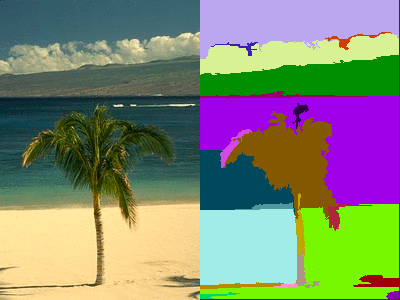

# Selective Search

When we use a sliding window over a image pyramid, we always tend to increase the number of classifications. This is because the sliding window put across the whole image over different varying sizes cases the number of classifications to increase. This can be easily removed if we try to not perform the image classification over areas which are less important and rather focus on areas which are more important.

This can be easily achieved if we try to find the areas in the image which are similar in color and texture so that the whole area is processed in 1 go itself and only the areas which are dissimilar are processed by the classifier rather than processing similar images over and over again.

## Image Segmentation

To get the image's sections which have similar properties we can use a computer vision algorithm called image segmentation.

There are many image segmentation algorithms present, like the "Superpixel Algorithm" or the "Graph Based Image Segmentation" algorithm.

### Algorithm Metrics

Image segmentation uses the following metrics to find the similar pixels to club them together:

1. Color Similarity: Using the Histogram Intersection Distance

2. Texture Similarity: Histogram Intersection with Gaussian derivatives

3. Size Similarity: using Hierarchical Agglomerative Clustering

4. Shape Similarity: Region Comparison

5. Meta Similarity: A final similarity to check the above conditions

Once we have the selective regions, we can pass a bounding box of these regions to the classifier to classify these objects. At last, we can collect all the classification which have a confidence score above a preset threshold.

# Reference

[1]: <https://www.pyimagesearch.com/2020/06/29/opencv-selective-search-for-object-detection/> "OpenCV Selective Search for Object Detection - PyImageSearch"
