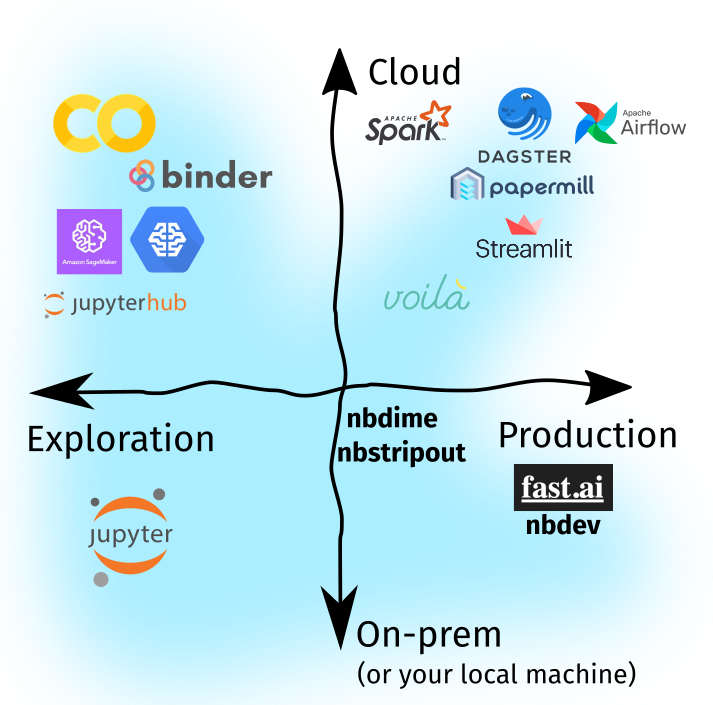

# Intro To ML Tools

<!-- toc -->

* [Tool Groups](#tool-groups)
* [Tools](#tools)
  + [Local and Explorative](#local-and-explorative)
  + [Explorative and Cloud](#explorative-and-cloud)
  + [Production Use and Cloud](#production-use-and-cloud)
* [Other Important Tools](#other-important-tools)
  - [nbdime](#nbdime)
    + [nbstripout](#nbstripout)
    + [nbconvert](#nbconvert)
    - [Reference](#reference)

<!-- tocstop -->

There are multiple tools available for ML but they vary from the normal software development tools in many ways. These tools can be devided into 3 groups:

- Explorative and Local
- Explorative and Distributed
- Production use and Distributed 

## Tool Groups

The tools can be either useful for experimentation or for production and it can be either good for local use or well suited for cloud use case scenarios.

- **Explorative Tools**: Tools under this category are mainly used for easy and fast implementation of ideas and exploration of known methods. These tools may not be well suited for production as they lack the ability to scale and use the system resources judicously.
- **Local Tools**: These tools are meant to run in a closed local environment like a single laptop/desktop or single instance in a cloud. These are mostly used for easy prototyping and experimentation of different implementations. They provide easy interface for testing out scenarios. But they like the explorative tools lack the ability to scale and judiciousl use the system resources. These are often not used in production.
- **Cloud Tools**: These can be either explorative or production ready tools. These tools have the ability to run on a distributed cloud architecture and can judiciusly use sytem resources and allocate and releive resources according to the need.
- **Production Tools**: These tools are mostly suited for production and real life scenarios. They can be easily scaled. Often they have the ability to allocate and relieve resources as per need. But they lack the ability to tweek or tinker if small changes are needed to be made.

## Tools

### Local and Explorative

- **Jupyter Lab**: It is an succesor to the famous Jupyter Notebook. It provides many additional features compared to jupyter notebook like git integration, multiple file support, better notebook ide, etc
- **Jupyter Notebook**: It is most extensively used tool in ML. It provides easy documentation and coding platform as a result it is widley accepted norm. It also provides easy visualizations and graphing features for exploratory data analysis.
- **Pycharm IDE + Notebook extension**: It is mainly used to develop python libraries but later with the introdcution of the Notebook extension, it is nowadays also used for ML related workflow.
- **VS Code + Notebook extension**: It is similar to Pycharm, but a bit more light weight and lacks some features compared to Pycharm.

Usually data scientists use this for fast prototyping new implementations and to tweak existing models as per need.

It also mainly used for it documentation feature so as to properly document and log the experimentation performed.

It is easy to work with and can be easily installed and managed in local environment. It provides a lot of extension for easy documentations and other features.

**Highly Recommended**: Jupyer Lab or Notebook

### Explorative and Cloud

- **Jupyter Hub**
- **Amazon SageMaker**
- **Google Colab**
- **Binder**

These usually provide powerful hardware(GPU, TPU, etc) so as to work on extensive amount of data. But as these applications are hosted on cloud, they might either be premium or the free tire might have limited functionality.

**Highly Recomended**: Google Colab

### Production Use and Cloud

- **Papermill**: for parametrizing and running notebooks as you’d do for Python scripts.
- **Apache Spark**: for Big Data Analysis.
- **Dagster**: Notebook-based data pipelines.
- **Apache Airflow**: Notebook-based data pipelines.
- **voila**: for a Jupyter-native experience of building web-apps without the knowledge of frontend frameworks.
- **Streamlit**: can be used to create web-apps in-tandem with `nbconvert`.

## Other Important Tools

#### nbdime

This is manily used in conjunction with git. As the local notebooks have a bit comlex structure, it is not easy to be version controlled using tools like git, which are mostly developed for simple text based files.

Notebooks, even though same, can look different to git even if they differ in output or execution time. In such cases nbdime can be used to compare the actual content of the notebooks rather than the exact structre.

### nbstripout

It is also like nbdime is used in conjunction with a version control software. Its main task is to strip the notebook of its tags, metadata and output cells so as to easily compare the contents and version them accordingly.

### nbconvert

It is useful for converting the .ipynb extension (the file extension used by notebooks) files into .pdf, .py, .md or .txt files.

- magics

# Reference

[1]: https://ljvmiranda921.github.io/notebook/2020/03/06/jupyter-notebooks-in-2020/ [How to use Jupyter Notebooks in 2020]
